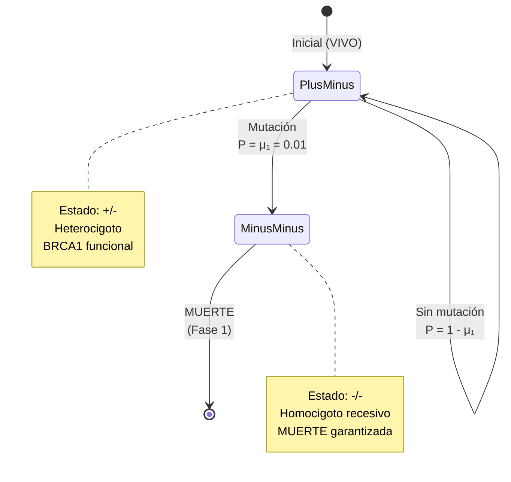
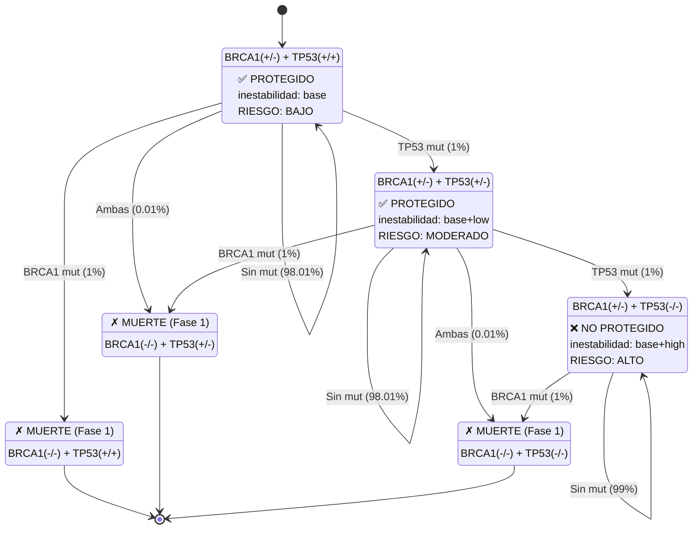
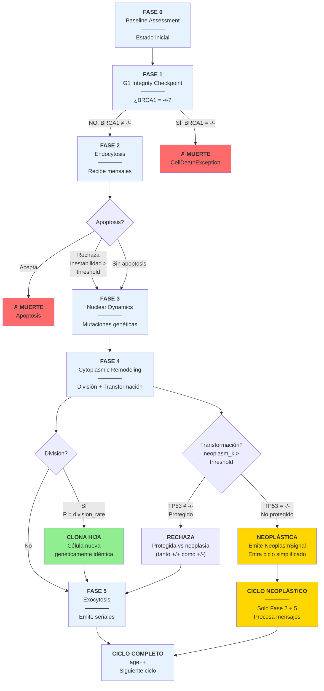
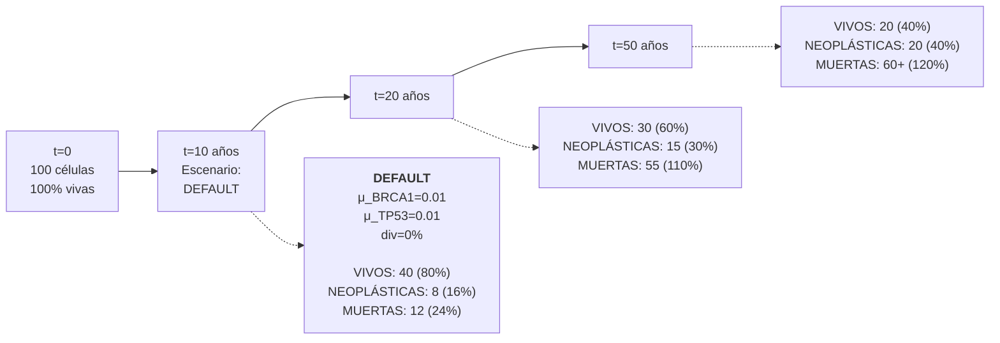
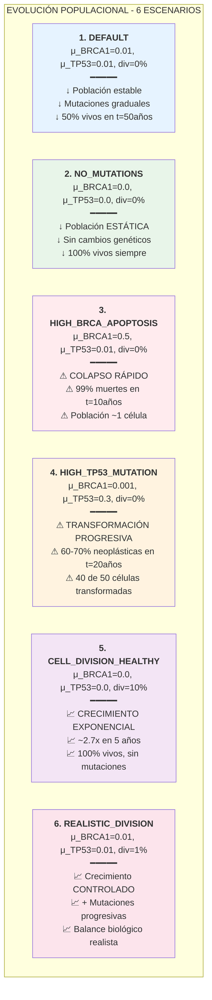
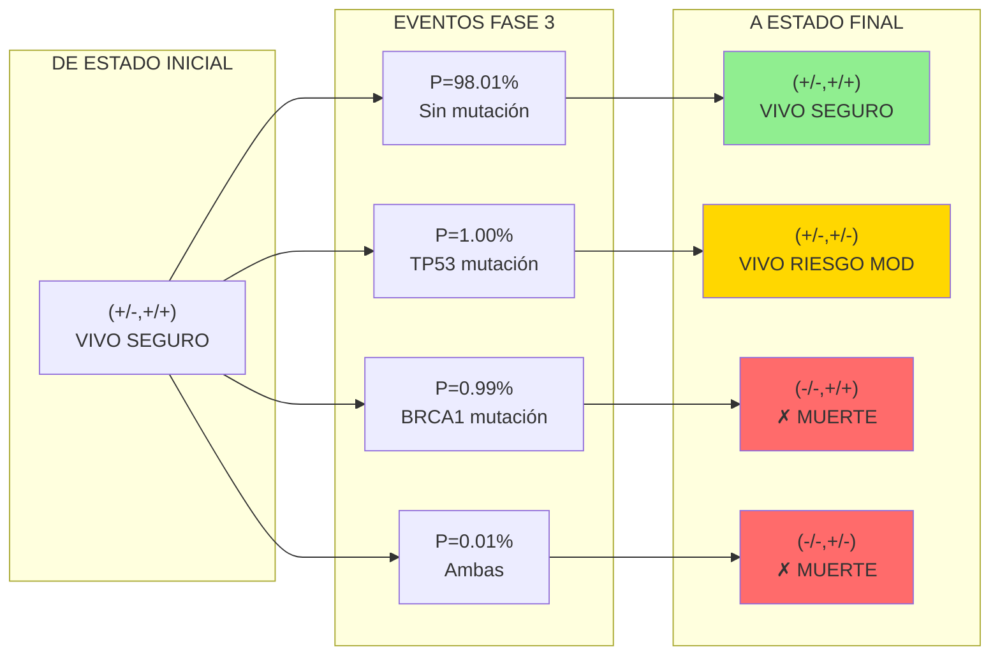
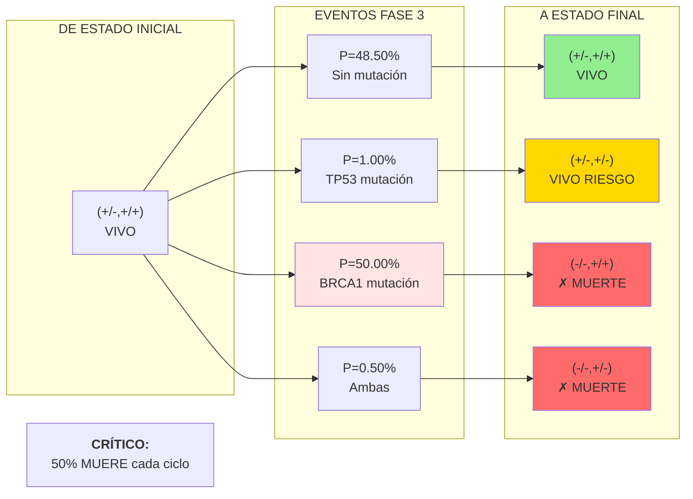

# 📊 Diagramas Mermaid - Simulador cellSim

Visualización interactiva de la dinámica celular. Los diagramas se renderizan automáticamente en GitHub.

---

## 1️⃣ FSM DE GENES

### 🧬 Gen BRCA1: Modelo de Viabilidad

**Matemática:**
- `P(+/- → -/-) = μ₁ = threshold_BRCA1 × (1 + k_BRCA1) × genomic_instability`
- **Irreversible**: Una vez en `-/-`, muerte en siguiente Fase 1
- **Escenario DEFAULT**: `μ₁ = 0.01` (1% por ciclo)

---

### 🛡️ Gen TP53: Modelo de Guardián Tumoral

**Matemática:**
- `P(+/+ → +/-) = μ₁ = threshold_TP53 × (1 + k_TP53) × genomic_instability`
- `P(+/- → -/-) = μ₂ = threshold_TP53 × (1 + k_TP53) × genomic_instability`
- **Protección contra neoplasia:** `status != "-/-"` → **PROTEGIDO** (tanto +/+ como +/-)
- **Aumento de inestabilidad:** 
  - TP53 `+/+` → inestabilidad base
  - TP53 `+/-` → inestabilidad += `low_delta_instability`
  - TP53 `-/-` → inestabilidad += `high_delta_instability`
- **Escenario DEFAULT**: `μ₁ = μ₂ = 0.01` (1% por ciclo)

---

### 🔗 FSM Combinado: BRCA1 + TP53 (2D State Space)

**Tabla de Transiciones (DEFAULT scenario):**

| De estado | Evento | A estado | P(transición) | Protección | Inestabilidad | Resultado |
|-----------|--------|----------|---------------|-----------|----------------|-----------|
| (+/-,+/+) | BRCA1 mut | (-/-,+/+) | 0.0099 | ✅ | base | ✗ MUERTE (Fase 1) |
| (+/-,+/+) | TP53 mut | (+/-,+/-) | 0.0100 | ✅ | base+low | VIVO (protegido, degradado) |
| (+/-,+/+) | Ambas | (-/-,+/-) | 0.0001 | ✅ | base+low | ✗ MUERTE (Fase 1) |
| (+/-,+/+) | Sin mut | (+/-,+/+) | 0.9801 | ✅ | base | VIVO (seguro) |
| | | | | | | |
| (+/-,+/-) | BRCA1 mut | (-/-,+/-) | 0.0099 | ✅ | base+low | ✗ MUERTE (Fase 1) |
| (+/-,+/-) | TP53 mut | (+/-,-/-) | 0.0100 | ❌ | base+high | VIVO (vulnerable neoplasia) |
| (+/-,+/-) | Ambas | (-/-,-/-) | 0.0001 | ❌ | base+high | ✗ MUERTE (Fase 1) |
| (+/-,+/-) | Sin mut | (+/-,+/-) | 0.9801 | ✅ | base+low | VIVO (protegido, degradado) |
| | | | | | | |
| (+/-,-/-) | BRCA1 mut | (-/-,-/-) | 0.0100 | ❌ | base+high | ✗ MUERTE (Fase 1) |
| (+/-,-/-) | Sin mut | (+/-,-/-) | 0.9900 | ❌ | base+high | VIVO (vulnerable neoplasia) |

---

## 2️⃣ CICLO DE VIDA CELULAR (6 Fases)

**Descripción de fases:**

| Fase | Nombre | Acción | Checkpoint |
|------|--------|--------|-----------|
| **0** | Baseline Assessment | Muestra estado celular | - |
| **1** | G1 Integrity | ¿BRCA1 = -/-? | ✗ SI = MUERTE |
| **2** | Endocytosis | Procesa apoptosis | ¿Rechaza? |
| **3** | Nuclear Dynamics | Mutaciones de genes | - |
| **4** | Cytoplasmic Remodeling | División + Transformación | ¿División? ¿Neoplasia? |
| **5** | Exocytosis | Emite señales | - |

---

## 3️⃣ DINÁMICA DE POBLACIÓN (Evolución temporal)

### Comparación de 6 Escenarios

---

## 4️⃣ MATRIZ DE TRANSICIÓN (Probabilidades)

### Escenario DEFAULT (μ_BRCA1=0.01, μ_TP53=0.01)

### Escenario HIGH_BRCA_APOPTOSIS (μ_BRCA1=0.5, μ_TP53=0.01)

---

## 📊 Leyenda Completa

### Estados Genéticos:
- **+/+** = Homocigoto dominante (ambos alelos funcionales)
- **+/-** = Heterocigoto (1 alelo funcional, 1 deficiente)
- **-/-** = Homocigoto recesivo (ambos alelos deficientes)

### Notación Probabilística:
- `μᵢ` = Probabilidad de mutación del gen i
- `threshold` = Umbral base de mutación
- `k` = Coeficiente de inestabilidad
- `genomic_instability` = Multiplicador de inestabilidad

### Estados Celulares:
- 🟢 **VIVO SEGURO** = BRCA1(+/-) + TP53(+/+) → Bajo riesgo, protegido
- 🟡 **RIESGO MODERADO** = BRCA1(+/-) + TP53(+/-) → Riesgo medio, PROTEGIDO (inestabilidad elevada)
- 🔴 **RIESGO ALTO** = BRCA1(+/-) + TP53(-/-) → Alto riesgo neoplasia (NO PROTEGIDO)
- ⚫ **NEOPLÁSTICA** = TP53(-/-) + transformación → Emite señales, ciclo simplificado
- ⚪ **MUERTE** = BRCA1(-/-) o apoptosis aceptada

### Colores:
- 🟢 Verde = Seguro, bajo riesgo
- 🟡 Dorado = Riesgo moderado
- 🔴 Rojo = Muerte, alto riesgo
- 🔵 Azul = Procesamiento, neutral

---

## 🔬 Cómo interpretar los diagramas

**⚠️ PUNTO CRÍTICO: Protección TP53**
- **TP53 +/+** → Protegido, inestabilidad base
- **TP53 +/-** → **SIGUE PROTEGIDO**, pero inestabilidad aumenta (low_delta)
- **TP53 -/-** → **NO PROTEGIDO**, inestabilidad muy elevada (high_delta), vulnerable a neoplasia

**Para Biólogos:**
- Enfocarse en FSM de genes (mutaciones biológicamente realistas)
- Ciclo de vida muestra checkpoints de viabilidad
- TP53 +/- es una "degradación progresiva" de protección, no una pérdida total

**Para Matemáticos:**
- Ver matriz de transición (cadenas de Markov)
- Probabilidades combinadas dan tasas de cambio de población
- Inestabilidad crece cuadráticamente + deltas aditivos por TP53

**Para Investigadores:**
- Comparar 6 escenarios (impacto de mutaciones en población)
- Predecir dinámica a largo plazo
- Distinguir entre "protegido" (TP53 ≠ -/-) y "vulnerable" (TP53 = -/-)

---

**Nota:** Estos diagramas se renderizan automáticamente en GitHub. Si los ves en CLion, aparecen como código Mermaid (legible igualmente).

