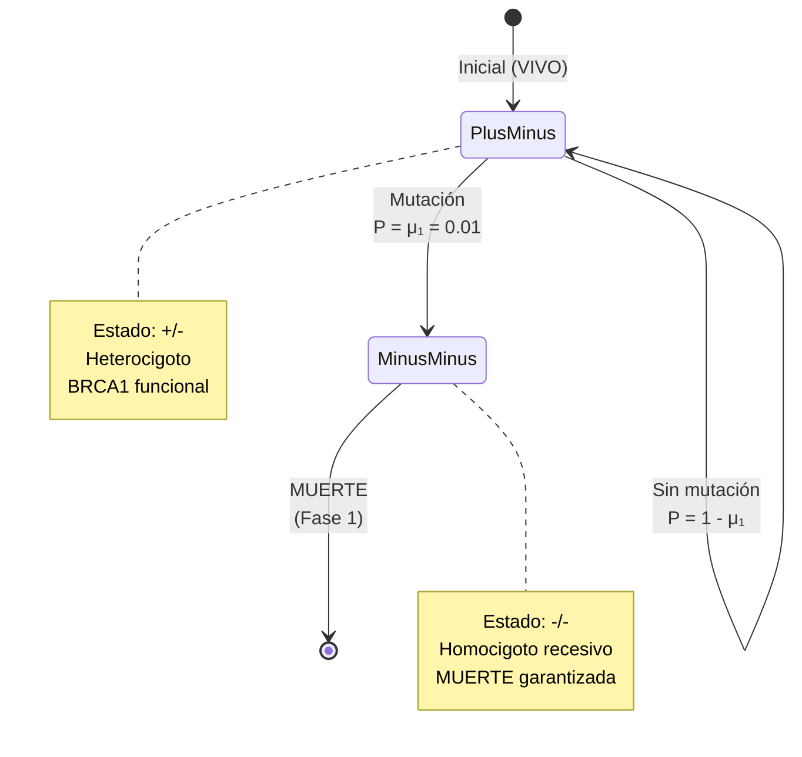
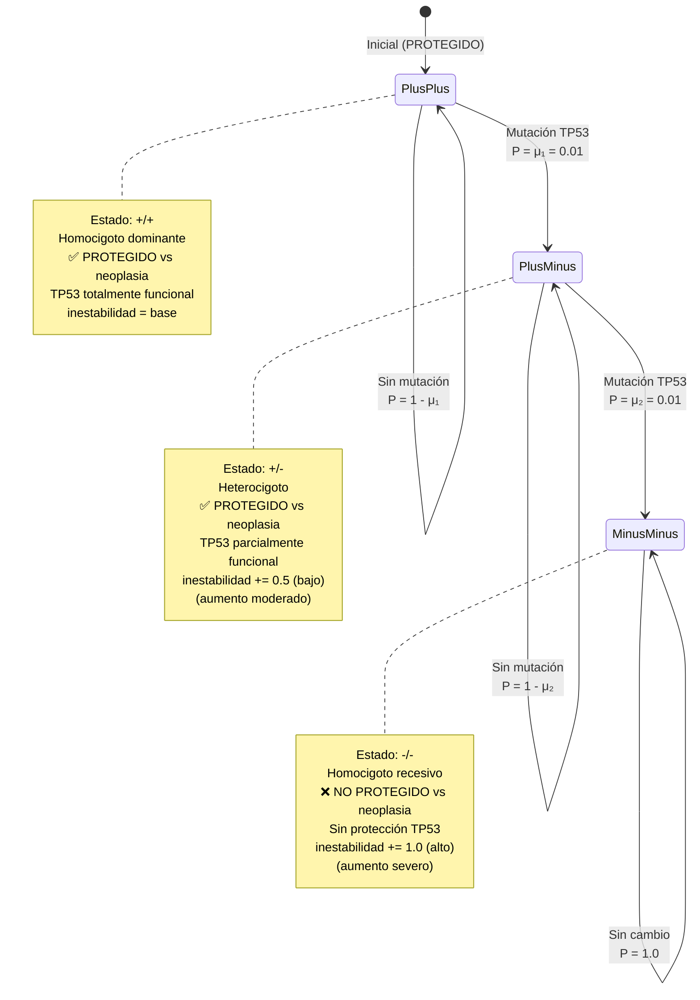
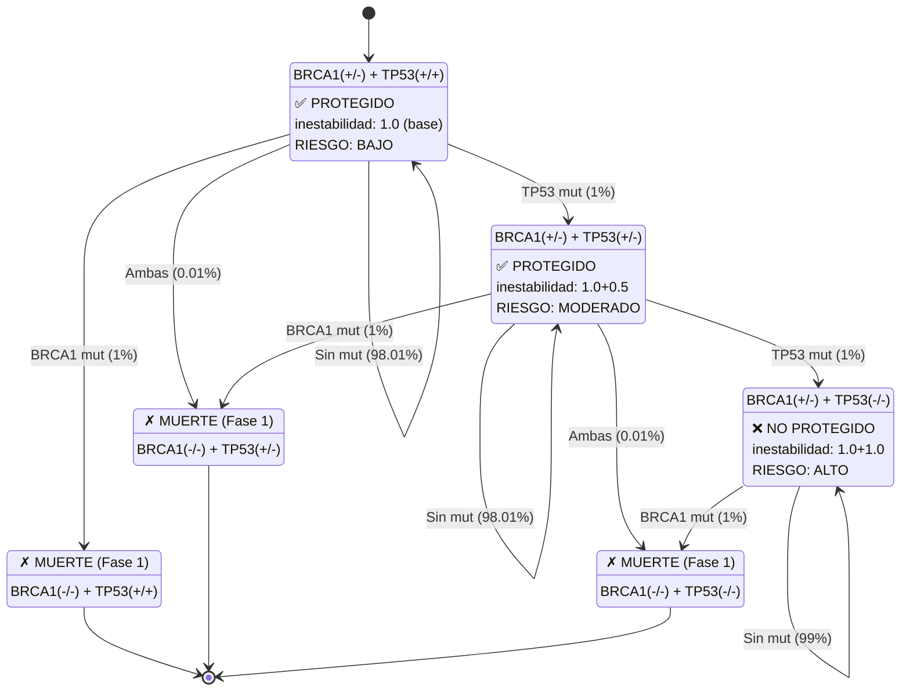
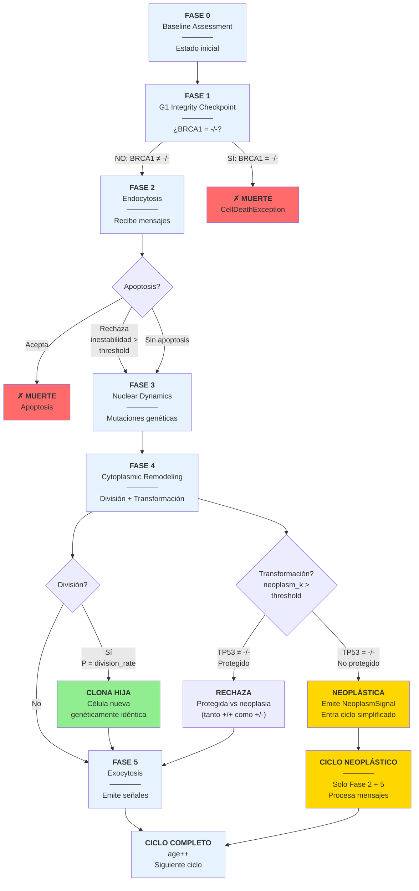
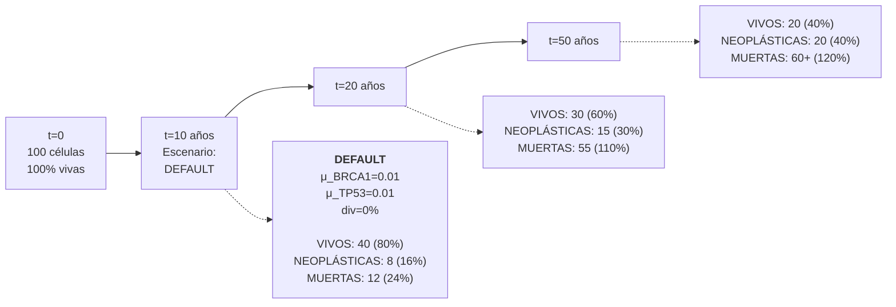
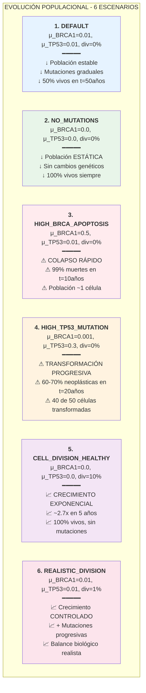
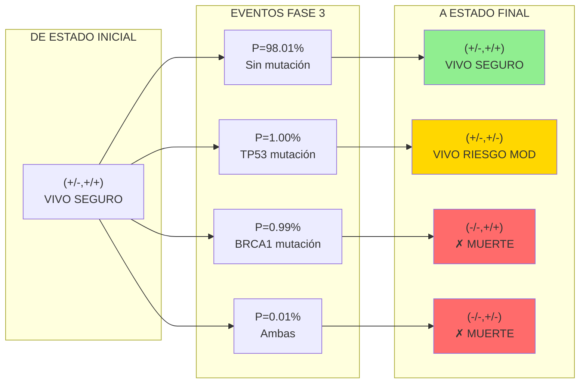
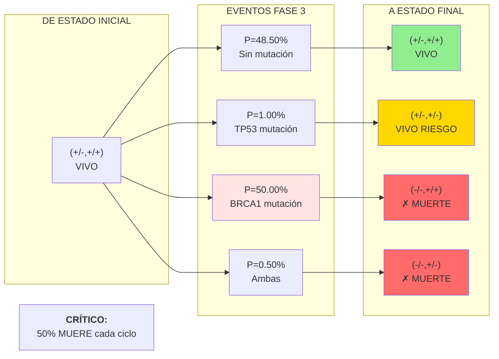
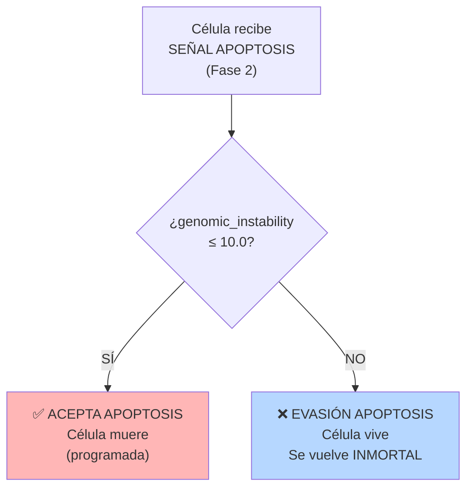
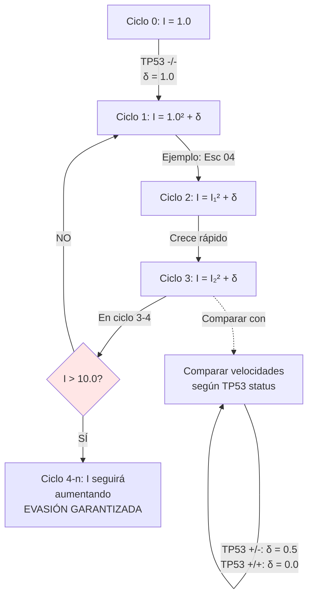

# 📊 Diagramas Mermaid - Simulador cellSim

Visualización interactiva de la dinámica celular. Los diagramas se renderizan automáticamente en GitHub.

---

## 1️⃣ FSM DE GENES

### 🧬 Gen BRCA1: Modelo de Viabilidad

**Matemática:**
- `P(+/- → -/-) = μ₁ = threshold_BRCA1 × (1 + k_BRCA1) × genomic_instability`
- **Irreversible**: Una vez en `-/-`, muerte en siguiente Fase 1
- **Escenario DEFAULT**: `μ₁ = 0.01` (1% por ciclo)

---

### 🛡️ Gen TP53: Modelo de Guardián Tumoral

**Matemática:**
- `P(+/+ → +/-) = μ₁ = threshold_TP53 × (1 + k_TP53) × genomic_instability`
- `P(+/- → -/-) = μ₂ = threshold_TP53 × (1 + k_TP53) × genomic_instability`
- **Protección contra neoplasia:** `status != "-/-"` → **PROTEGIDO** (tanto +/+ como +/-)
- **Transformación neoplástica:** `P = neoplasm_k` (default: 0.05) si TP53 = "-/-"
- **Aumento de inestabilidad (configurables):** 
  - TP53 `+/+` → inestabilidad base (1.0)
  - TP53 `+/-` → inestabilidad += `low_delta_instability` (default: 0.5)
  - TP53 `-/-` → inestabilidad += `high_delta_instability` (default: 1.0)
- **Escenario DEFAULT**: `μ₁ = μ₂ = 0.01` (1% por ciclo), `neoplasm_k = 0.05` (5%)

---

### 🔗 FSM Combinado: BRCA1 + TP53 (2D State Space)

**Tabla de Transiciones - ESCENARIOS VALIDADOS:**

| Escenario | De estado | Evento | A estado | P(transición) | Protección | Inestabilidad | Resultado |
|-----------|-----------|--------|----------|---------------|-----------|----------------|-----------|
| **03: BRCA1=0.2** | (+/-,+/+) | BRCA1 mut | (-/-,+/+) | 0.20 | ✅ | base | ✗ MUERTE (Fase 1) - LETAL |
| **04: TP53=0.1** | (+/-,+/+) | TP53 mut | (+/-,+/-) | 0.10 | ✅ | 1.0+0.5 | VIVO (protegido, degradado) |
| **04: TP53=0.1** | (+/-,-/-) | Transf neo | NEOPLÁSTICA | 0.10 | ❌ | 1.0+1.0 | VULNERABLE → 98% neo, 100% inmortales |
| **07: TP53=0.005** | (+/-,+/+) | TP53 mut | (+/-,+/-) | 0.005 | ✅ | 1.0+0.5 | VIVO (muy protegido) |
| **07: TP53=0.005** | (+/-,-/-) | Transf neo | NEOPLÁSTICA | 0.05 | ❌ | 1.0+1.0 | BAJO RIESGO → 2.5% neo, 100% inmortales |
| (+/-,+/-) | Ambas | (-/-,-/-) | 0.0001 | ❌ | base+high | ✗ MUERTE (Fase 1) |
| (+/-,+/-) | Sin mut | (+/-,+/-) | 0.9801 | ✅ | base+low | VIVO (protegido, degradado) |
| | | | | | | |
| (+/-,-/-) | BRCA1 mut | (-/-,-/-) | 0.0100 | ❌ | base+high | ✗ MUERTE (Fase 1) |
| (+/-,-/-) | Sin mut | (+/-,-/-) | 0.9900 | ❌ | base+high | VIVO (vulnerable neoplasia) |

---

## 2️⃣ CICLO DE VIDA CELULAR (6 Fases)

**Descripción de fases:**

| Fase | Nombre | Acción | Checkpoint |
|------|--------|--------|-----------|
| **0** | Baseline Assessment | Muestra estado celular | - |
| **1** | G1 Integrity | ¿BRCA1 = -/-? | ✗ SI = MUERTE |
| **2** | Endocytosis | Procesa apoptosis | ¿Rechaza? |
| **3** | Nuclear Dynamics | Mutaciones de genes | - |
| **4** | Cytoplasmic Remodeling | División + Transformación | ¿División? ¿Neoplasia? |
| **5** | Exocytosis | Emite señales | - |

---

## 3️⃣ DINÁMICA DE POBLACIÓN (Evolución temporal)

### Comparación de 6 Escenarios

---

## 4️⃣ MATRIZ DE TRANSICIÓN (Probabilidades)

### Escenario DEFAULT (μ_BRCA1=0.01, μ_TP53=0.01)

### Escenario HIGH_BRCA_APOPTOSIS (μ_BRCA1=0.5, μ_TP53=0.01)

---

## 📊 Leyenda Completa

### Estados Genéticos:
- **+/+** = Homocigoto dominante (ambos alelos funcionales)
- **+/-** = Heterocigoto (1 alelo funcional, 1 deficiente)
- **-/-** = Homocigoto recesivo (ambos alelos deficientes)

### Notación Probabilística:
- `μᵢ` = Probabilidad de mutación del gen i
- `threshold` = Umbral base de mutación
- `k` = Coeficiente de inestabilidad
- `genomic_instability` = Multiplicador de inestabilidad

### Estados Celulares:
- 🟢 **VIVO SEGURO** = BRCA1(+/-) + TP53(+/+) → Bajo riesgo, protegido
- 🟡 **RIESGO MODERADO** = BRCA1(+/-) + TP53(+/-) → Riesgo medio, PROTEGIDO (inestabilidad elevada)
- 🔴 **RIESGO ALTO** = BRCA1(+/-) + TP53(-/-) → Alto riesgo neoplasia (NO PROTEGIDO)
- ⚫ **NEOPLÁSTICA** = TP53(-/-) + transformación → Emite señales, ciclo simplificado
- ⚪ **MUERTE** = BRCA1(-/-) o apoptosis aceptada

### Colores:
- 🟢 Verde = Seguro, bajo riesgo
- 🟡 Dorado = Riesgo moderado
- 🔴 Rojo = Muerte, alto riesgo
- 🔵 Azul = Procesamiento, neutral

---

## 4️⃣.5️⃣ UMBRAL DE EVASIÓN DE APOPTOSIS (CRÍTICO)

### Decisión de Apoptosis Basada en Inestabilidad

**Parámetro Global:** `apoptosis_instability_threshold = 10.0`

**Validación Experimental:**
- **Esc 04** (TP53=-/-, high_δ=1.0): Año 3 → inestability > 10.0 → 100% inmortales ❌
- **Esc 07** (TP53=+/-, high_δ=1.0): Crece más lentamente → Solo 2.5% inmortales ✅
- **Esc 09** (Balanceado): 4.7% inmortales (realista) ✅

---

## 4️⃣.6️⃣ EVOLUCIÓN EXPONENCIAL DE INESTABILIDAD

### Dinámica Temporal: I(t+1) = I(t)² + δ(TP53_status)

**Tabla de Evolución - Escenario 04 (TP53 = -/-, high_δ = 1.0):**

| Ciclo | I(t) | Cálculo | vs Threshold | Estado |
|-------|------|---------|--------------|--------|
| 0 | 1.0000 | inicial | < 10.0 ✅ | Apoptosis activa |
| 1 | 2.0000 | 1.0² + 1.0 | < 10.0 ✅ | Apoptosis activa |
| 2 | 5.0000 | 2.0² + 1.0 | < 10.0 ✅ | Apoptosis activa |
| 3 | **26.0000** | 5.0² + 1.0 | > 10.0 ❌ | **EVASIÓN APOPTOSIS** |
| 4+ | Muy alto | 26.0² + 1.0 | >> 10.0 ❌ | INMORTAL GARANTIZADO |

**Conclusión:** Inestabilidad crece exponencialmente. Una vez > threshold, célula es inmortal.

---

## 🔬 Cómo interpretar los diagramas

**⚠️ PUNTO CRÍTICO: Protección TP53**
- **TP53 +/+** → Protegido, inestabilidad base (1.0), δ = 0.0
- **TP53 +/-** → **SIGUE PROTEGIDO**, pero inestabilidad aumenta (δ = 0.5, aumento moderado)
- **TP53 -/-** → **NO PROTEGIDO**, inestabilidad muy elevada (δ = 1.0, aumento severo), vulnerable a neoplasia

**⚠️ PUNTO CRÍTICO: Evasión de Apoptosis**
- Si `genomic_instability ≤ 10.0` → Apoptosis activa ✅ (célula puede morir)
- Si `genomic_instability > 10.0` → Evasión apoptosis ❌ (célula se vuelve inmortal)
- Esto explica por qué 100% de neoplásticas son inmortales en escenarios validados

**⚠️ PUNTO CRÍTICO: Inestabilidad Exponencial**
- Fórmula: `I(t+1) = I(t)² + δ(TP53_status)` (crece cuadráticamente + delta aditivo)
- Implica: TP53 -/- alcanzan threshold en ~3-4 ciclos, TP53 +/- toman más tiempo
- Resultado: Células con TP53 -/- son rápidamente inmortales

**Para Biólogos:**
- Enfocarse en FSM de genes (mutaciones biológicamente realistas)
- Ciclo de vida muestra checkpoints de viabilidad
- Protección TP53 es gradual: +/+ (total) → +/- (parcial) → -/- (nula)

**Para Matemáticos:**
- Ver matriz de transición (cadenas de Markov)
- Probabilidades combinadas dan tasas de cambio de población
- Inestabilidad sigue ecuación dinámica: I(t+1) = I(t)² + δ (caótica si δ > 0)
- Threshold = barrera de absorción para evasión apoptosis

**Para Investigadores:**
- Comparar 9 escenarios validados (09 = más realista)
- Predecir dinámica a largo plazo considerando threshold apoptosis
- Distinguir entre "protegido" (TP53 ≠ -/-) y "vulnerable" (TP53 = -/-)
- Entender por qué inestabilidad progresiva = inevitablemente inmortales

---

**Nota:** Estos diagramas se renderizan automáticamente en GitHub. Si los ves en CLion, aparecen como código Mermaid (legible igualmente).

