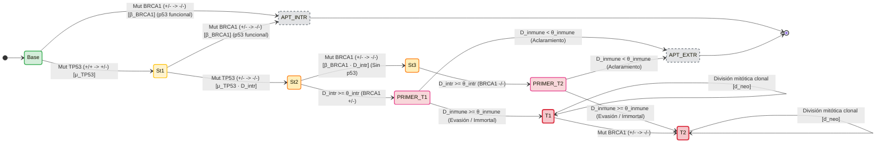

# Especificación Formal de Estados, Transiciones y Dinámica Multidimensional del Modelo cellSim
*Actualizado conforme al Working Paper de Validación Secundaria (28 de agosto de 2026)*

---

## 1. Introducción y Marco Fisiológico

Este documento formaliza la estructura de estados, variables continuas, condiciones de guardia y transiciones estocásticas del modelo multiescala basado en agentes **cellSim**, alineando estrictamente la nomenclatura y las dinámicas biofísicas con el **Working Paper 2026-01 de Validación Secundaria** (`docs/paper20260828_1_validation_secondary/working_paper_secondary_validation.md`) y el diagrama conceptual `docs/diagrams_luis/estado_1.png`.

El modelo describe la carcinogénesis mamaria en una población de portadoras heterocigotas de $BRCA1$ ($BRCA1^{+/-}$), modelando el tejido epitelial como un colectivo de **Células Agénticas (*Agentic Cells*)** que toman decisiones autónomas en ciclos discretos de un año ($t$).

---

## 2. Dimensiones y Variables del Estado Celular

Cada célula $C_i$ en el instante $t$ se encuentra definida en un espacio multidimensional continuo-discreto por la tupla:

$$\mathbf{S}(t) = \Big( \text{TP53}(t),\; \text{BRCA1}(t),\; D_{\text{intrínseca}}(t),\; D_{\text{inmune}}(t),\; \text{neoplastic}(t),\; \text{alive}(t) \Big)$$

```
                                  ▲ Eje Z: Espacio Fenotípico Continuo
                                 /   (D_intrínseca, D_inmune)
                                /
                               /       ┌─────────────────────────────────────┐
                              /       /   PLANO SUPERIOR (Z=2: TUMORAL)     /│  DESTINOS NEOPLÁSICOS
                             /       /   T1: Tumoral BRCA1+/- (Clon Exp.)  / │  (D_intr ≥ θ_intr, D_inmune ≥ θ_inmune)
                            /       /   T2: Tumoral BRCA1-/- (Hipermutado)/  │  Fenotipo A (Escape) / B (Contención)
                           /       └─────────────────────────────────────┘   │  División mitótica d_neo (Big Bang)
                          /                           ▲                      │
                         /                            │ Evasión D_inmune ≥ θ_inmune
                        /              ┌──────────────┴──────────────────┐   │
                       /              /     PLANO MEDIO (Z=1: PRIMER)   /│   │  ESTADO PRE-TUMORAL
                      /              /    Pre-T1 (Carrier)  Pre-T2 (LOH)/ │  │  (D_intr ≥ θ_intr, D_inmune < θ_inmune)
                     /              └───────────────────────────────────┘ │  │  Sometido a vigilancia tisular
                    /                                 ▲                   │  /
                   /                                  │ Daño D_intr ≥ θ_intr│ /   SUMIDEROS DE MUERTE:
                  /              ┌────────────────────┴─────────────┐     │/    • APT. INTRÍNSECA (en Z=0)
                 /              /       PLANO BASAL (Z=0: SANO)    /      └─►   • APT. EXTRÍNSECA (en Z=1)
                /              / [Base] ──> [St. 1] ──> [St. 2]   /
               /              └──────────────────────────────────┘
              /                             │
             /                              ▼
            └──────────────────────────────────────────────────────────► Eje X: TP53 (+/+, +/-, -/-)
            │                                                            (Interruptor On/Off de Apoptosis)
            ▼ Eje Y: BRCA1 (+/- ──▶ -/-)
              (Dial de Latencia Somática)
```

### 2.1 Ejes Genotípicos Discretos ($X, Y$)

1. **Eje $X$ — Supresión Tumoral y Checkpoint (`TP53` $\in \{ +/+, +/- , -/- \}$):**
   - **$+/+$ (Homocigoto Silvestre / Wild-Type):** Control homeostático y checkpoint de integridad $G_1/S$ plenamente activo.
   - **$+/-$ (Heterocigoto / Inestabilidad Incipiente):** Haploinsuficiencia parcial; el checkpoint apoptótico sigue activo frente a daño catastrófico.
   - **$-/-$ (Nulo / Inactivación Bialélica):** Pérdida completa de la proteína p53. **El checkpoint se desactiva**, permitiendo la supervivencia de células con daño severo.
   - *Dinámica de degradación:* Tasa de mutación somática $\mu_{TP53} = 0.0030\text{ año}^{-1}$ (`tp53_rate`), actuando como un **interruptor fisiológico On/Off de frontera**.

2. **Eje $Y$ — Vía de Reparación Homóloga (`BRCA1` $\in \{ +/-, -/- \}$):**
   - **$+/-$ (Portador Germinal Heterocigoto):** Estado basal en la cohorte (*Kuchenbaecker et al., JAMA 2017*). Reparación de roturas de doble cadena activa pero susceptible a microlesiones.
   - **$-/-$ (Pérdida Somática del Segundo Alelo / LOH):** Colapso total de la recombinación homóloga.
   - *Dinámica de transición:* Probabilidad anual $\beta_{BRCA1} = 0.0459\text{ año}^{-1}$ (`brca1_rate`), actuando como un **dial continuo de latencia clínica**.

> ⚠️ **Regla Biológica de Letalidad Sintética (Fase 1):**  
> Si una célula en estado `BASELINE` ($TP53^{+/+}$) o `UNSTABLE` ($TP53^{+/-}$) experimenta la mutación $BRCA1^{+/-} \to BRCA1^{-/-}$, **la célula es eliminada de inmediato por apoptosis intrínseca (`APT. INTR`)**. La supervivencia con $BRCA1^{-/-}$ solo es posible si $TP53$ ya ha mutado a $-/-$.

---

### 2.2 Eje Fenotípico Continuo ($Z$): Dinámica de Inestabilidad y Evasión

El estado continuo $Z$ está compuesto por dos acumuladores de daño biológico:

#### 1. Daño ADN Intrínseco / Inestabilidad Genómica ($D_{\text{intrínseca}} \in [1.0, 999.0]$, en código `d1`)
Cuantifica la acumulación de lesiones macromoleculares y aberraciones cromosómicas. Acelera la probabilidad de mutaciones genéticas:
$$P(\text{mutación}_g) = \text{rate}_g \cdot D_{\text{intrínseca}}(t)$$

* **Umbral Crítico $\theta_{D\text{\_intrinseca}} = 2.0$ (Barrera Pre-Neoplásica):**  
  Bajo fondo $TP53^{-/-}$, cuando $D_{\text{intrínseca}} \ge \theta_{D\text{\_intrinseca}}$, la célula entra en estado **PRIMER** (pre-tumoral detectable por el tejido).

#### 2. Resistencia Inmune / Evasión Extrínseca ($D_{\text{inmune}} \in [1.0, 999.0]$, en código `d2`)
Cuantifica la capacidad celular de evadir o neutralizar las señales pro-apoptóticas inducidas por el estroma y la vigilancia linfocitaria.

* **Umbral Crítico $\theta_{D\text{\_inmune}} = 5.0$ (Barrera de Evasión Extrínseca / Inmune):**  
  Punto de bifurcación decisivo en el estado PRIMER:
  - Si $D_{\text{inmune}} < \theta_{D\text{\_inmune}} \implies$ **Eliminación por Apoptosis Extrínseca (`APT. EXTR`)**.
  - Si $D_{\text{inmune}} \ge \theta_{D\text{\_inmune}} \implies$ **Evasión Inmune, Inmortalización y Progresión a TUMORAL**.
* **Ratio de Barrera $\theta_{D\text{\_inmune}} / \theta_{D\text{\_intrinseca}} = 2.5$:** Formaliza matemáticamente que franquear la vigilancia inmune exige $2.5\times$ más acumulación biofísica que la inestabilidad celular intrínseca inicial.

---

### 2.3 Ecuaciones de Crecimiento de Inestabilidad ($\delta_{\text{BRCA+}}$ y $\delta_{\text{BRCA-}}$)

A cada tick anual de simulación, los acumuladores se actualizan:

$$D_{\text{intrínseca}}(t+1) = \min\!\Big( D_{\text{intrínseca}}(t) + \delta_{\text{intrínseca}}(t) + \epsilon \cdot \text{age},\; 999.0 \Big)$$

$$D_{\text{inmune}}(t+1) = \min\!\Big( D_{\text{inmune}}(t) + \delta_{\text{inmune}}(t) + \epsilon \cdot \text{age},\; 999.0 \Big)$$

donde $\epsilon = 10^{-5}$ es el factor basal de envejecimiento tisular y los incrementos dependen del estado genético:

| Estado Genético | $\delta_{\text{intrínseca}}$ | $\delta_{\text{inmune}}$ | Significado Biológico |
| :--- | :---: | :---: | :--- |
| **`BASELINE` ($TP53^{+/+}, BRCA1^{+/-}$)** | $0$ | $0$ | Tejido sano en reposo homeostático |
| **`UNSTABLE` ($TP53^{+/-}, BRCA1^{+/-}$)** | $\delta_{\text{BRCA+}}$ | $\delta_{\text{BRCA+}}$ | Inestabilidad leve con $BRCA1$ activo ($\delta_{\text{BRCA+}} = 0.1067$) |
| **`UNPROTECTED` ($TP53^{-/-}, BRCA1^{+/-}$)** | $\delta_{\text{BRCA-}}$ | $\delta_{\text{BRCA+}}$ | Sin p53; daño acelerado ($\delta_{\text{BRCA-}} = 0.3533$) |
| **`UNPROTECTED (LOH)` ($TP53^{-/-}, BRCA1^{-/-}$)** | $\delta_{\text{BRCA-}}$ | $2 \cdot \delta_{\text{BRCA-}}$ | Doble pérdida; daño genómico e inmune catastrófico |

---

## 3. Matriz de Estados Homogénea

| ID 3D | Genotipo ($TP53, BRCA1$) | Estado Fenotípico ($D_{\text{intrínseca}}, D_{\text{inmune}}$) | Nombre Paper 2026 | Nombre `estado_1.png` | Destino y Dinámica Biológica |
| :---: | :---: | :---: | :---: | :---: | :--- |
| **$S_0$** | `(+/+, +/-)` | $D_{\text{intrínseca}} < \theta_{D\text{\_intr}}$ | `BASELINE` | `Base` | Célula normal sana; recambio mitótico basal ($d_{\text{basal}} = 0.0010$). |
| **$S_1$** | `(+/- , +/-)` | $D_{\text{intrínseca}} < \theta_{D\text{\_intr}}$ | `UNSTABLE` | `St. 1` (↑ $D_{\text{intr}}$) | Pérdida de un alelo TP53; inestabilidad basal lenta $\delta_{\text{BRCA+}}$. |
| **$S_2$** | `(-/- , +/-)` | $D_{\text{intrínseca}} < \theta_{D\text{\_intr}}$ | `UNPROTECTED` | `St. 2` (↑↑ $D_{\text{intr}}, D_{\text{inm}}$) | Inactivación bialélica TP53; hipermutabilidad $\delta_{\text{BRCA-}}$. |
| **$S_3$** | `(-/- , -/-)` | $D_{\text{intrínseca}} < \theta_{D\text{\_intr}}$ | `UNPROTECTED (LOH)`| `St. 3` (↑↑↑ $D_{\text{intr}}, D_{\text{inm}}$)| Pérdida completa de BRCA1 sin TP53; aceleración masiva. |
| **$S_4$** | `(-/- , +/-)` | $D_{\text{intr}} \ge \theta_{D\text{\_intr}},\; D_{\text{inm}} < \theta_{D\text{\_inm}}$ | `PRIMER` | Pre-T1 (Vulnerable) | Pre-neoplásica portadora; en riesgo de aclaramiento tisular. |
| **$S_5$** | `(-/- , -/-)` | $D_{\text{intr}} \ge \theta_{D\text{\_intr}},\; D_{\text{inm}} < \theta_{D\text{\_inm}}$ | `PRIMER (Double-Hit)`| Pre-T2 (Vulnerable) | Pre-neoplásica $BRCA1^{-/-}$; en riesgo de aclaramiento tisular. |
| **$T_1$** | `(-/- , +/-)` | $D_{\text{intr}} \ge \theta_{D\text{\_intr}},\; D_{\text{inm}} \ge \theta_{D\text{\_inm}}$ | `TUMORAL (Carrier)` | `T1` (↑↑) | **Neoplásica Inmortal**; proliferación clonal ($d_{\text{neo}} = 0.1584$). |
| **$T_2$** | `(-/- , -/-)` | $D_{\text{intr}} \ge \theta_{D\text{\_intr}},\; D_{\text{inm}} \ge \theta_{D\text{\_inm}}$ | `TUMORAL (LOH)` | `T2` (↑↑↑) | **Neoplásica Inmortal**; clon $BRCA1^{-/-}$ hipermutado. |
| **$\Omega_{\text{int}}$** | `(+/+ \lor +/-, -/-)` | Cualquiera | `DEAD (Intrinsic)` | `APT. INTR` | **Muerte por Checkpoint p53** (Letalidad sintética por $BRCA1^{-/-}$). |
| **$\Omega_{\text{ext}}$** | `(-/- , *)` | $D_{\text{intr}} \ge \theta_{D\text{\_intr}},\; D_{\text{inm}} < \theta_{D\text{\_inm}}$ | `DEAD (Extrinsic)` | `APT. EXTR` | **Muerte por Vigilancia Inmune** (Fallo de evasión en PRIMER). |

---

## 4. El Ciclo Celular Agéntico de Seis Fases

A cada tick anual, toda célula viva ejecuta estrictamente las siguientes fases en orden secuencial:

```
┌─────────────────────────────────────────────────────────────────────────────────────────────┐
│                             CICLO VITAL CELULAR EN 6 FASES                                  │
└─────────────────────────────────────────────────────────────────────────────────────────────┘
  Fase 0: Evaluación de Viabilidad   ──> Comprueba si la célula sigue viva.
  Fase 1: Checkpoint G1/S (p53)      ──> Si BRCA1 == -/- y TP53 funcional (+/+, +/-) ──> APT. INTRÍNSECA (DEAD)
  Fase 2: Checkpoint Extrínseco      ──> Si PRIMER y llega señal tisular:
                                          • Si D_inmune < θ_D_inmune ──> APT. EXTRÍNSECA (DEAD)
                                          • Si D_inmune ≥ θ_D_inmune ──> EVASIÓN INMUNE ──> TUMORAL
  Fase 3: Dinámica Nuclear (Mutación)──> Mutaciones estocásticas de TP53 y BRCA1 moduladas por D_intrínseca.
  Fase 4: Remodelación y División    ──> Si PRIMER con D_inmune ≥ θ_D_inmune ──> Transformación neoplásica.
                                          Si TUMORAL ──> Mitosis clonal acelerada con probabilidad d_neo.
  Fase 5: Actualización de Daño      ──> Incremento de D_intrínseca y D_inmune según δ_BRCA+ / δ_BRCA-.
```

---

## 5. Subtipos Tumorales Emergentes (Fenotipos A y B)

El modelo reproduce la emergencia de dos fenotipos tumorales observados en la calibración bayesiana:

```
                    ▲ Tasa de Proliferación Neoplásica (d_neo)
                    │
                    │   ┌──────────────────────────────────────────────┐
                    │   │ FENOTIPO A: Escape Proliferativo Clonal      │
         d_neo ≈ 0.189 ─┼─► │ • Menor inestabilidad basal (δ_BRCA+ ≈ 0.095)│
                    │   │ • Rápida colonización y expansión celular    │
                    │   └──────────────────────────────────────────────┘
                    │
                    │   ┌──────────────────────────────────────────────┐
                    │   │ FENOTIPO B: Contención Tisular / Resiliente  │
         d_neo ≈ 0.133 ─┼─► │ • Mayor inestabilidad basal (δ_BRCA+ ≈ 0.116)│
                    │   │ • Retraso en saturación tisular (+2.44 años) │
                    │   └──────────────────────────────────────────────┘
                    └─────────────────────────────────────────────────────► Inestabilidad BRCA1+ (δ_BRCA+)
                                  δ_BRCA+ ≈ 0.095     δ_BRCA+ ≈ 0.116
```

---

## 6. Esquema de Transiciones en Grafo de Estados



---

## 7. Directrices para la Representación Visual 3D

Para la construcción de la figura tridimensional:
1. **Dimensiones ortogonales:**
   - **X**: TP53 ($+/+ \to +/- \to -/-$).
   - **Y**: BRCA1 ($+/- \to -/-$).
   - **Z**: Elevación fenotípica por planos de daño ($Z=0$: Homeostasis basal, $Z=1$: Alerta PRIMER, $Z=2$: Neoplasia TUMORAL).
2. **Sumideros de Apoptosis:**
   - Pozo de **Apoptosis Intrínseca** (caída vertical lateral en $Z=0$ desde $S_0$ y $S_1$).
   - Pozo de **Apoptosis Extrínseca** (caída inferior en $Z=1$ desde $PRIMER$).
3. **Formatos de Salida recomendados:**
   - Script generador en Python (`matplotlib` 3D vectorial / `plotly`) exportando a PDF de alta resolución ($300\text{ dpi}$) y PNG transparente para el paper.
