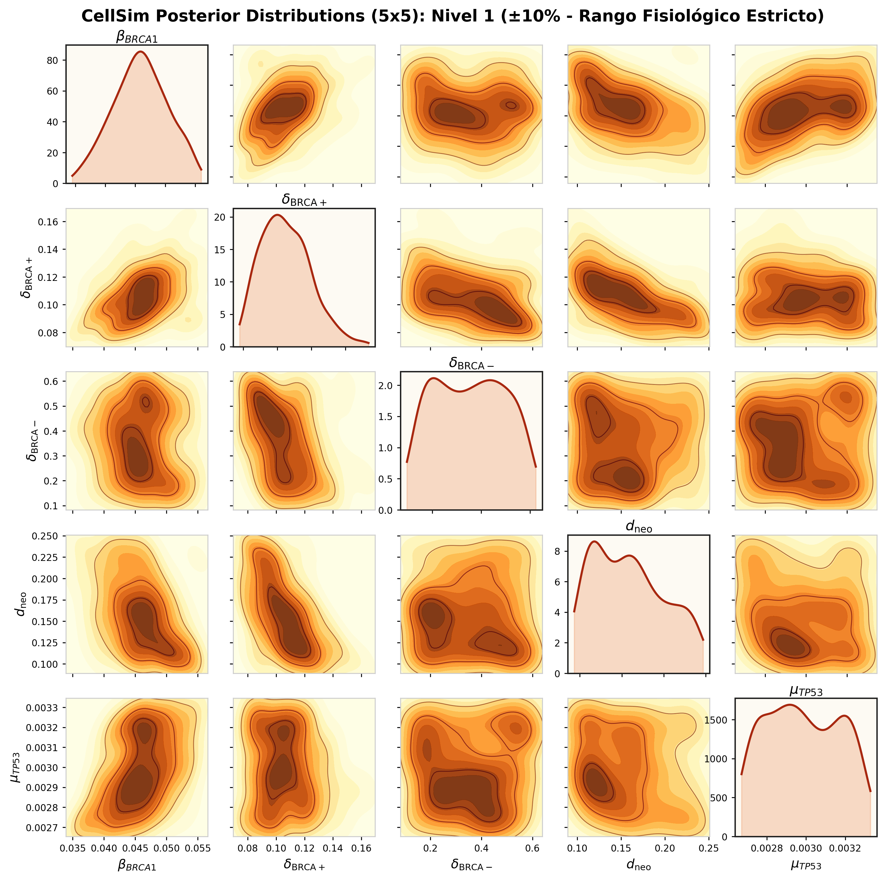
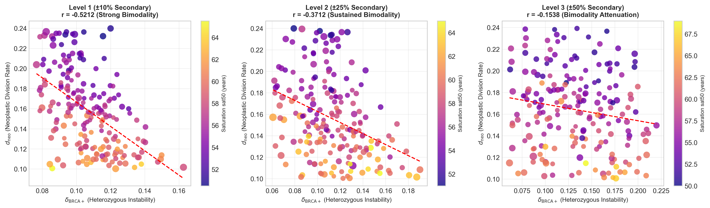
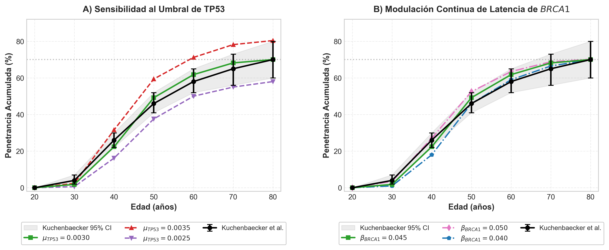
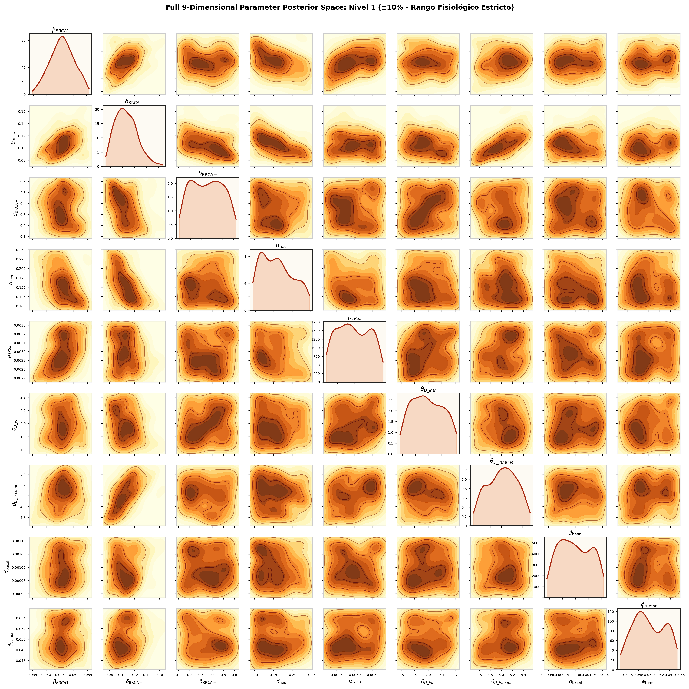
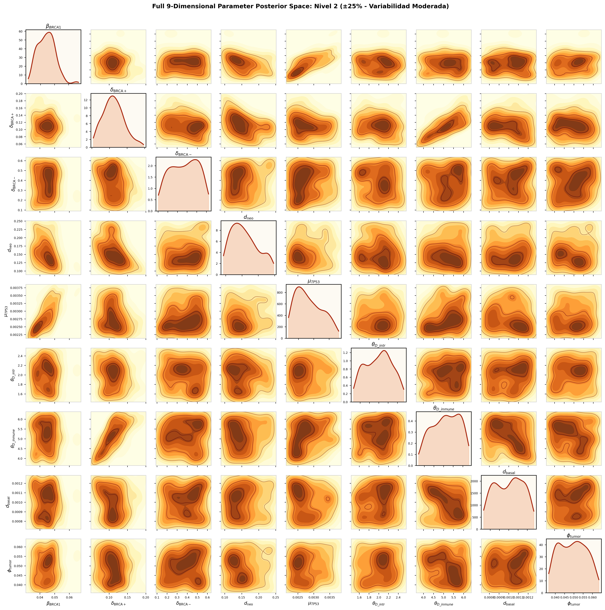
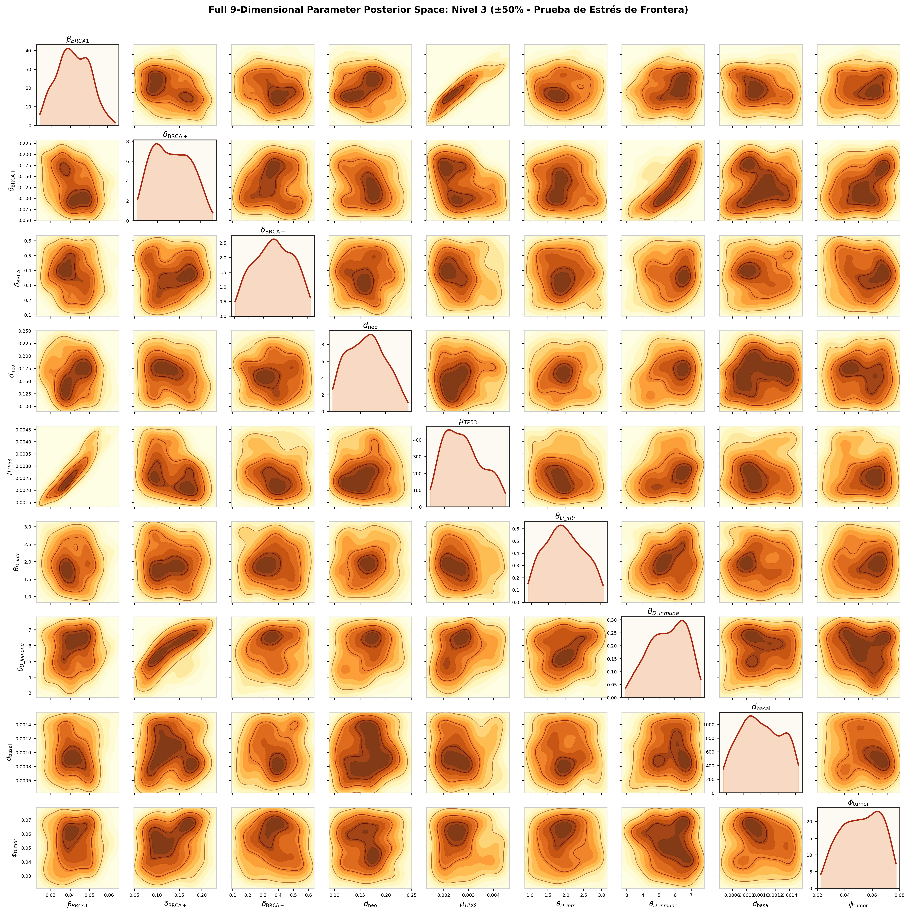

# cellSim Working Paper 2026-01: Evaluación de Sensibilidad Global de Parámetros Secundarios, Reducción de Varianza Multivariante y Dinámica Fisiológica TP53/BRCA1

**Autores:** Equipo cellSim  
**Fecha:** 28 de agosto de 2026  
**Documento de Trabajo:** `docs/paper20260828_1_validation_secondary/working_paper_secondary_validation.md`  
**Clasificación:** Biología Teórica, Oncología Matemática, Inferencia Bayesiana (ABC-SMC)

---

## Resumen Ejecutivo (Abstract)

En este documento de trabajo se analiza la robustez estructural, la identificabilidad bayesiana y la resiliencia del modelo estocástico multiescala basado en agentes **cellSim** ante la relajación simultánea de los parámetros que permanecieron fijos en su calibración original. Mediante un protocolo de Approximate Bayesian Computation con Sequential Monte Carlo (ABC-SMC) estructurado en tres niveles crecientes de libertad e incertidumbre ($\pm10\%$, $\pm25\%$ y $\pm50\%$), se evalúa la contracción del espacio posterior frente a la cohorte epidemiológica de referencia de portadoras de $BRCA1^{+/-}$ (*Kuchenbaecker et al., JAMA 2017*). 

Demostramos que:
1. **Dominancia de Parámetros Primarios:** La tasa de mutación somática del segundo alelo de $BRCA1$ ($\beta_{BRCA1}$) y el coeficiente de inestabilidad con $BRCA1$ activo ($\delta_{\text{BRCA+}}$, antes denominado $\delta_{low}$) concentran la práctica totalidad de la identificabilidad bayesiana, contrayendo sus intervalos de credibilidad al 95% a una fracción estrecha del prior ($\beta_{BRCA1} = 0.0459 \pm 0.0041$ [$95\%\text{ CI: } 0.0381, 0.0535$] y $\delta_{\text{BRCA+}} = 0.1067 \pm 0.0164$ [$95\%\text{ CI: } 0.0795, 0.1403$]).
2. **Naturaleza de Parámetros *Sloppy* (Blandos):** Los parámetros secundarios (`d1_threshold` / $\theta_{D\text{\_intrinseca}}$, `d2_threshold` / $\theta_{D\text{\_inmune}}$, `division_rate`, `tumor_threshold`) presentan distribuciones posteriores planas que abarcan la totalidad del soporte a priori con centros de gravedad invariantes en sus valores originales $\theta_0$ ($95\%\text{ CI}$ coincidentes con los límites del prior). Esto demuestra matemáticamente que los datos epidemiológicos clínicos agregados no restringen sus valores individuales y que fijarlos en el diseño base responde estrictamente al principio de parsimonia (Navaja de Ockham).
3. **El Gen TP53 como Interruptor Fisiológico On/Off:** A diferencia de $BRCA1$ (cuya tasa de mutación $\beta_{BRCA1}$ modula continuamente la latencia clínica), la tasa de degradación de $TP53$ ($\text{tp53\_rate} = 0.0030$) actúa como una condición de frontera biológica crítica: un incremento de apenas $+0.0005$ destruye la meseta clínica del $\approx 70\%$ de penetrancia acumulada observada en pacientes humanas a los 80 años, disparando el error cuadrático global ($SSE$) en un $+1200\%$.
4. **Estabilidad de Fenotipos Tumorales:** La estructura bimodal de dos subtipos tumorales emergentes—**Fenotipo A (Escape Proliferativo Clonal / Alta Proliferación)** y **Fenotipo B (Contención Tisular / Basal-Resiliente)**—se mantiene invariante en los niveles fisiológicos de incertidumbre ($\pm10\%$ y $\pm25\%$), colapsando únicamente en el nivel extremo ($\pm50\%$) por inducción de ruido blanco estocástico derivado de la sobre-parametrización.

---

## 1. Introducción y Marco del Modelo

### 1.1 Contexto Biológico y Definición del Modelo Agentic Cell

La carcinogénesis mamaria en pacientes portadoras de mutaciones germinales heterocigotas en el gen $BRCA1$ ($BRCA1^{+/-}$) representa un proceso biológico complejo gobernado por la interacción estocástica entre la pérdida de función de reparación genómica, la vigilancia apoptótica y la capacidad de evasión del microambiente celular.

El simulador **cellSim** modela este proceso mediante el paradigma de **Células Agénticas (*Agentic Cells*)**, donde cada célula del tejido epitelial actúa como un agente computacional autónomo con estado interno, ciclo de vida secuencial y toma de decisiones probabilística basada en umbrales de daño.

```
       ┌─────────────────────────────────────────────────────────────────────────────────────────────┐
       │                          ESTADOS Y TRANSICIONES DEL AGENTE CELULAR                          │
       └─────────────────────────────────────────────────────────────────────────────────────────────┘

  [BASELINE]              [UNSTABLE]              [UNPROTECTED]          [PRIMER]                  [TUMORAL]
  BRCA1: +/-              BRCA1: +/-              BRCA1: +/-             BRCA1: +/- o -/-          BRCA1: -/-
  TP53:  +/+       ──>    TP53:  +/-       ──>    TP53:  -/-      ──>    D_intrinseca ≥ θ_D_intr ──> D_inmune ≥ θ_D_inmune
  (Sano/Estable)          (Daño Leve)             (Sin Freno p53)        (Pre-tumoral)             (Evasión Inmune)
       │                       │
       │ (Si BRCA1 muta -/-)   │ (Si BRCA1 muta -/-)
       ▼                       ▼
    [DEAD]                  [DEAD]
  (Apoptosis p53)         (Apoptosis p53)
```

> ⚠️ **Regla Biológica Fundamental de Viabilidad:** Si una célula en estado `BASELINE` (TP53 $+/+$) o `UNSTABLE` (TP53 $+/-$) experimenta la pérdida somática del segundo alelo de BRCA1 ($BRCA1^{+/-} \to BRCA1^{-/-}$), **la célula es eliminada inmediatamente por apoptosis (transición directa a `DEAD`)**. La presencia de proteína p53 funcional detecta el colapso en la recombinación homóloga e induce el suicidio celular. Para que una célula con daño severo en BRCA1 sobreviva y pueda progresar hacia la malignidad, **es requisito biológico sine qua non que TP53 haya mutado previamente a $-/-$ (`UNPROTECTED`)**.

Cada célula está caracterizada formalmente por **cuatro variables de estado y dos umbrales críticos de activación**:

1. **Estado Génico $BRCA1$:** Gen supresor tumoral responsable de la reparación de roturas de doble cadena de ADN por recombinación homóloga.
   * *Estado nativo:* $BRCA1^{+/-}$ (heterocigoto, funcional, vivo).
   * *Transición:* Mutación somática unidireccional del segundo alelo $BRCA1^{+/-} \to BRCA1^{-/-}$ con tasa probabilística anual $\beta_{BRCA1}$ (`brca1_rate`).
   * *Regla biológica de letalidad sintética:* Una célula $BRCA1^{-/-}$ en presencia de un gen $TP53$ funcional es detectada y sufre apoptosis intrínseca inmediata (`DEAD`). Solo si $TP53$ ha perdido su función ($-/-$), la célula $BRCA1^{-/-}$ sobrevive, acumulando daño genómico acelerado.
2. **Estado Génico $TP53$:** El "guardián del genoma", mediador maestro de la parada del ciclo celular y de la apoptosis intrínseca.
   * *Estados posibles:* $+/+$ (homocigoto funcional), $+/-$ (heterocigoto con función parcial), $-/-$ (nulo / deficiente).
   * *Transición:* Progresión mutacional estocástica $+/+ \to +/- \to -/-$ regida por la tasa base $\text{tp53\_rate}$.
3. **Acumulador $D_{\text{intrínseca}}$ y Umbral $\theta_{D\text{\_intrinseca}}$ (Daño ADN Intrínseco / Inestabilidad Genómica):** 
   * $D_{\text{intrínseca}}$ (denominado en código `d1`) es una variable continua adimensional que cuantifica la carga de daño macromolecular y aberraciones cromosómicas acumuladas.
   * *Dinámica de crecimiento:* $D_{\text{intrínseca}}(t+1) = D_{\text{intrínseca}}(t) + \delta_{\text{intrínseca}}(t) + \text{age\_factor}(t)$.
   * **Umbral $\theta_{D\text{\_intrinseca}} = 2.0$ (Barrera de Inestabilidad Intrínseca):** Punto de corte biofísico a partir del cual el daño supera la capacidad basal de reparación celular. Cuando $D_{\text{intrínseca}} \ge \theta_{D\text{\_intrinseca}}$ bajo fondo $TP53^{-/-}$, la célula transiciona al estado **PRIMER** (célula pre-neoplásica detectable por el microambiente).
4. **Acumulador $D_{\text{inmune}}$ y Umbral $\theta_{D\text{\_inmune}}$ (Resistencia Inmune / Evasión Extrínseca):** 
   * $D_{\text{inmune}}$ (denominado en código `d2` o daño extrínseco) es una variable continua adimensional que mide el grado de inmunorresistencia y la capacidad de anular las señales pro-apoptóticas inducidas por el estroma y los linfocitos citotóxicos.
   * *Dinámica de crecimiento:* $D_{\text{inmune}}(t+1) = D_{\text{inmune}}(t) + \delta_{\text{inmune}}(t) + \text{age\_factor}(t)$.
   * **Umbral $\theta_{D\text{\_inmune}} = 5.0$ (Barrera de Evasión Extrínseca / Inmune):** Punto de corte biológico que representa la neutralización de la vigilancia inmune. Cuando $D_{\text{inmune}} \ge \theta_{D\text{\_inmune}}$, la célula transiciona al estado **TUMORAL** (inmortalización celular, evasión de apoptosis extrínseca y desregulación proliferativa).
   * **Ratio de Barrera $\theta_{D\text{\_inmune}} / \theta_{D\text{\_intrinseca}} = 2.5$:** Esta asimetría formaliza matemáticamente que alcanzar la evasión inmune sostenida requiere $2.5\times$ más acumulación biológica que franquear la inestabilidad genómica intrínseca inicial.

---

### 1.2 Resumen de la Calibración Previa ABC-SMC y Comparación Epidemiológica

En la calibración fundamental de cellSim, el modelo fue parametrizado frente a la mayor cohorte clínica prospectiva de portadoras de $BRCA1$: el estudio de **Kuchenbaecker et al. (JAMA 2017)** ($N=9.856$ portadoras). A continuación, se presenta la comparación bidimensional entre la incidencia acumulada observada en la población general y en portadoras de $BRCA1^{+/-}$:

#### 📊 **Tabla Comparativa de Incidencia Acumulada de Cáncer de Mama por Edad: Población General vs. Portadoras BRCA1**

| Edad (Años) | IAPC | IACB |
| :---: | :---: | :---: |
| **20** | $0.00\%$ | $0.00\%$ |
| **30** | $0.08\%$ | $4.00\%$ |
| **40** | $0.59\%$ | $26.00\%$ |
| **50** | $2.23\%$ | $46.00\%$ |
| **60** | $4.80\%$ | $58.00\%$ |
| **70** | $8.14\%$ | $65.00\%$ |
| **80** | $11.18\%$ | $70.00\%$ |

*Definición de siglas y fuentes:* **IAPC**: Incidencia Acumulada en Población General (*SEER / DevCan Database; Cancer Research UK*). **IACB**: Incidencia Acumulada en Cohorte $BRCA1^{+/-}$ (*Kuchenbaecker et al., JAMA 2017*, vector objetivo $\mathbf{y}_{\text{obs}}$ empleado en cellSim).

Dado que la función de verosimilitud analítica $p(\mathbf{y}_{\text{obs}} \mid \theta)$ de un sistema estocástico de 500 células interactuando durante 80 años es intratable, se empleó **Approximate Bayesian Computation acoplado a Sequential Monte Carlo (ABC-SMC)** (*Toni et al., 2009; Liepe et al., 2014*).

```
┌─────────────────────────────────────────────────────────────────────────────┐
│                    ALGORITMO ABC-SMC (Toni et al. 2009)                     │
└─────────────────────────────────────────────────────────────────────────────┘
  Prior π(θ) ──> [Generación 0: ε = 20.0] ──> ρ(y*, y_obs) ≤ ε_0 (Rechazo)
                        │
                        ▼ (Kernel de Perturbación Gaussiano Adaptativo)
                 [Generación 1: ε = 15.43]
                        │
                        ▼
                 [Generación 2: ε = 11.61]
                        │
                        ▼
                 [Generación 3: ε = 8.19]
                        │
                        ▼
                 [Generación 4: ε = 6.20] ──> Posterior Final p(θ | y_obs)
                                               (Fit perfecto dentro de IC 95%)
```

#### Resultados Clave de la Calibración Base y Premisa de Parámetros Secundarios

1. **Identificación de Parámetros Primarios:** Se obtuvieron distribuciones a posteriori estrechas para:
   * $\beta_{BRCA1} = 0.0445 \pm 0.0041$ (tasa anual de segundo hit somático en $BRCA1$, $\sim 4.45\%$ anual).
   * $\delta_{\text{BRCA+}} = 0.1093 \pm 0.0189$ (inestabilidad con $BRCA1$ activo / heterocigoto, antes $\delta_{low}$).
   * $d_{\text{neo}} = 0.1564 \pm 0.0410$ (tasa de división y proliferación celular neoplásica).
2. **Estructura Bimodal y Gradiente Funcional (Subtipos de Crecimiento):** Se descubrió una fuerte anticorrelación lineal ($r = -0.609$, $p < 10^{-21}$) entre $\delta_{\text{BRCA+}}$ y $d_{\text{neo}}$. Desde una perspectiva biológica, esto refleja dos estrategias celulares distintas:
   * **Fenotipo A (Escape Proliferativo Clonal / Rápida Expansión):** $\delta_{\text{BRCA+}} \approx 0.095, d_{\text{neo}} \approx 0.189$. Presenta una barrera apoptótica más laxa que permite que, una vez superado el punto de control, el clon tumoral colonice el tejido rápidamente.
   * **Fenotipo B (Contención Tisular / Basal-Resiliente):** $\delta_{\text{BRCA+}} \approx 0.116, d_{\text{neo}} \approx 0.133$. Muestra una mayor vigilancia celular y contención por el microambiente estromal, lo que genera una acumulación lenta y difusa de daño (*field cancerization*) con saturación tisular retardada.
3. **Identificación Empírica de Parámetros Secundarios:** En aquella primera fase de calibración exploratoria, con el fin de garantizar la identificabilidad numérica del sistema y evitar el sobreajuste en un espacio de 9 dimensiones, **se identificaron y fijaron de forma empírica 5 parámetros secundarios**: $\text{tp53\_rate} = 0.0030$, $\theta_{D\text{\_intrinseca}} = 2.0$, $\theta_{D\text{\_inmune}} = 5.0$, $\text{division\_rate} = 0.0010$ y $\text{tumor\_threshold} = 0.05$.

> 🎯 **Motivación del Presente Estudio de Validación:** La decisión inicial de fijar estos 5 parámetros fue empírica y metodológica. Por tanto, el objetivo central de este documento de trabajo es **someter a prueba dicha premisa**: liberar sistemáticamente los parámetros secundarios en tres grados de libertad crecientes ($\pm10\%$, $\pm25\%$, $\pm50\%$) para validar formalmente si la fijación original era matemáticamente sólida y biológicamente neutra.

---

## 2. Diseño del Experimento de Sensibilidad Multinivel

### 2.1 Planteamiento del Problema: Identificabilidad y la Navaja de Ockham

Un desafío recurrente en la modelización matemática de sistemas biológicos complejos radica en la **identificabilidad de parámetros**: cuando el número de parámetros libres crece excesivamente frente a la dimensionalidad de las observaciones clínicas disponibles (en este caso, 6 puntos de incidencia acumulada $R(a)$ a lo largo de 80 años), los algoritmos de optimización e inferencia bayesiana caen en **variedades degeneradas (*sloppy manifolds*)**. En tales regiones del espacio, infinitas combinaciones arbitrarias de parámetros pueden generar curvas epidemiológicas macroscópicamente indistinguibles (*Gutenkunst et al., 2007; Transtrum et al., 2015; Liepe et al., 2014*).

En la calibración inicial de cellSim, se fijaron 5 parámetros secundarios basándose en consideraciones empíricas y biofísicas para permitir que los 4 parámetros primarios ($\beta_{BRCA1}$, $\delta_{\text{BRCA+}}$, $\delta_{\text{BRCA-}}$, $d_{\text{neo}}$) absorbieran la varianza biológicamente significativa. 

Para verificar de forma cuantitativa y rigurosa qué ocurre cuando todos los parámetros varían libremente, se diseñó el presente **experimento de sensibilidad bayesiana multinivel**.

```
       ┌─────────────────────────────────────────────────────────────────────────────┐
       │             DISEÑO DEL EXPERIMENTO DE SENSIBILIDAD MULTINIVEL               │
       └─────────────────────────────────────────────────────────────────────────────┘
  
   NIVEL 1: Margen Fisiológico (±10%)
   ──────────────────────────────────────────────────────────
   • Modela la incertidumbre y ruido de medición biológica.
   • tp53_rate ∈ [0.0027, 0.0033], θ_D_intr ∈ [1.8, 2.2], θ_D_inmune ∈ [4.5, 5.5], etc.

   NIVEL 2: Incertidumbre Intermedia (±25%)
   ──────────────────────────────────────────────────────────
   • Modela variabilidad biológica interindividual moderada.
   • tp53_rate ∈ [0.00225, 0.00375], θ_D_intr ∈ [1.5, 2.5], θ_D_inmune ∈ [3.75, 6.25], etc.

   NIVEL 3: Relajación Extrema (±50%)
   ──────────────────────────────────────────────────────────
   • Prueba de estrés / frontera: espacio no condicionado.
   • tp53_rate ∈ [0.0015, 0.0045], θ_D_intr ∈ [1.0, 3.0], θ_D_inmune ∈ [2.5, 7.5], etc.
```

---

### 2.2 Taxonomía de Parámetros del Modelo y Espacio de Búsqueda ABC-SMC

Para facilitar la comprensión del sistema antes de detallar los rangos numéricos de búsqueda, a continuación se describe la taxonomía completa de los parámetros del modelo, divididos en **Parámetros Primarios** (objeto central de inferencia clínica) y **Parámetros Secundarios** (factores de escala biofísica y calibración homeostática):

#### 📋 **Tabla Preámbulo: Taxonomía y Significado Biológico de los Parámetros del Modelo**

| Tipo | Parámetro en Código | Símbolo Matemático | Significado Biológico y Rol Fisiológico | Rango Típico / Unidades | Justificación de su Clasificación |
| :--- | :--- | :---: | :--- | :---: | :--- |
| **PRIMARIO** | `brca1_rate` | $\beta_{BRCA1}$ | **Tasa de Mutación Somática de $BRCA1$:** Probabilidad anual de pérdida somática del segundo alelo ($BRCA1^{+/-} \to BRCA1^{-/-}$). Actúa como dial de latencia temporal. | $[0.025, 0.080]\text{ año}^{-1}$ | **Rígido (*Stiff*):** Controla directamente la edad de inicio y pendiente de penetrancia clínica. |
| **PRIMARIO** | `low_delta` | $\delta_{\text{BRCA+}}$ | **Inestabilidad con $BRCA1$ Activo ($BRCA1^{+/-}$):** Tasa basal de acumulación de daño genómico e inmune en células heterocigotas viables. | $[0.060, 0.220]\text{ daño/año}$ | **Rígido (*Stiff*):** Dicta la velocidad de avance hacia el estado pre-tumoral en portadoras. |
| **PRIMARIO** | `high_delta` | $\delta_{\text{BRCA-}}$ | **Inestabilidad con $BRCA1$ Desactivado ($BRCA1^{-/-}$):** Tasa acelerada de daño catastrófico tras la pérdida somática completa de reparación homóloga. | $[0.120, 0.600]\text{ daño/año}$ | **Sloppy condicionado:** Satura rápidamente al superar la barrera $\delta_{\text{BRCA-}} > \delta_{\text{BRCA+}}$. |
| **PRIMARIO** | `neoplastic_div_rate` | $d_{\text{neo}}$ | **Tasa de Proliferación Neoplásica:** Velocidad de mitosis clonal desregulada una vez alcanzado el estado tumoral. | $[0.100, 0.240]\text{ año}^{-1}$ | **Acoplado:** Define los fenotipos tumorales A (expansión rápida) y B (contención tisular). |
| **SECUNDARIO** | `tp53_rate` | $\mu_{TP53}$ | **Tasa de Mutación Somática de $TP53$:** Probabilidad de transición $+/+ \to +/- \to -/-$. Interruptor on/off de apoptosis. | $0.0030\text{ año}^{-1}$ | **Interruptor de Frontera:** Fija la meseta clínica de penetrancia acumulada a los 80 años (~70%). |
| **SECUNDARIO** | `d1_threshold` | $\theta_{D\text{\_intrinseca}}$ | **Umbral de Daño Intrínseco:** Nivel de daño ADN acumulado necesario para alcanzar el estado pre-tumoral (`PRIMER`). | $2.00\text{ (adimensional)}$ | **Factor de Escala:** Define la unidad de medida de daño celular interno. |
| **SECUNDARIO** | `d2_threshold` | $\theta_{D\text{\_inmune}}$ | **Umbral de Evasión Inmune/Extrínseca:** Nivel de daño necesario para franquear la barrera inmune y convertirse en `TUMORAL`. | $5.00\text{ (adimensional)}$ | **Factor de Escala:** Ratio $\theta_{D\text{\_inmune}}/\theta_{D\text{\_intrinseca}} = 2.5$ fija la contención inmune. |
| **SECUNDARIO** | `division_rate` | $d_{\text{basal}}$ | **Tasa de División Basal del Tejido:** Recambio mitótico fisiológico del epitelio mamario en reposo. | $0.0010\text{ año}^{-1}$ | **Cinéticamente Neutro:** $150\times$ inferior a la tasa proliferativa tumoral $d_{\text{neo}}$. |
| **SECUNDARIO** | `tumor_threshold` | $\phi_{\text{tumor}}$ | **Fracción Tumoral de Inicio Clínico:** Porcentaje de células transformadas para detección clínica ($10^9$ células $\approx 1\text{ cm}^3$). | $0.05\text{ (5\%)}$ | **Fisiológicamente Neutro:** Equivale a la resolución mamográfica clínica estándar. |

---

#### Espacio de Búsqueda y Distribuciones a Priori en el Experimento Multinivel

El experimento libera **simultáneamente los 9 parámetros del modelo** en el motor ABC-SMC (`scripts/abc_sensitivity_v5.py`). Mientras los 4 parámetros primarios mantienen sus distribuciones a priori ancladas en la literatura, los 5 parámetros secundarios adoptan distribuciones a priori uniformes $U[a, b]$ centradas en su valor de referencia con una dispersión controlada por el nivel:

$$\theta_k \sim U\left[\theta_{k,0}(1 - \Delta), \, \theta_{k,0}(1 + \Delta)\right] \quad \text{con } \Delta \in \{0.10, 0.25, 0.50\}$$

| Parámetro | Rol en el Modelo | Valor Base ($\theta_0$) | Nivel 1 ($\pm10\%$) | Nivel 2 ($\pm25\%$) | Nivel 3 ($\pm50\%$) |
| :--- | :--- | :---: | :---: | :---: | :---: |
| **`brca1_rate` ($\beta_{BRCA1}$)** | *Primario (Mutación segundo hit)* | — | $U[0.025, 0.080]$ | $U[0.025, 0.080]$ | $U[0.025, 0.080]$ |
| **`low_delta` ($\delta_{\text{BRCA+}}$)** | *Primario (Inestabilidad BRCA1 activo)* | — | $U[0.060, 0.220]$ | $U[0.060, 0.220]$ | $U[0.060, 0.220]$ |
| **`high_delta` ($\delta_{\text{BRCA-}}$)** | *Primario (Inestabilidad BRCA1 desactivado)* | — | $U[0.120, 0.600]$ | $U[0.120, 0.600]$ | $U[0.120, 0.600]$ |
| **`neoplastic_div_rate` ($d_{\text{neo}}$)**| *Primario (Proliferación tumoral)* | — | $U[0.100, 0.240]$ | $U[0.100, 0.240]$ | $U[0.100, 0.240]$ |
| **`tp53_rate`** | Secundario (Tasa mutación TP53) | $0.0030$ | $U[0.0027, 0.0033]$ | $U[0.00225, 0.00375]$ | $U[0.0015, 0.0045]$ |
| **`d1_threshold` ($\theta_{D\text{\_intrinseca}}$)** | Secundario (Barrera pre-neoplásica) | $2.00$ | $U[1.80, 2.20]$ | $U[1.50, 2.50]$ | $U[1.00, 3.00]$ |
| **`d2_threshold` ($\theta_{D\text{\_inmune}}$)** | Secundario (Barrera evasión inmune) | $5.00$ | $U[4.50, 5.50]$ | $U[3.75, 6.25]$ | $U[2.50, 7.50]$ |
| **`division_rate`** | Secundario (División basal del tejido) | $0.0010$ | $U[0.0009, 0.0011]$ | $U[0.00075, 0.00125]$ | $U[0.0005, 0.0015]$ |
| **`tumor_threshold`** | Secundario (Fracción clínica inicio) | $0.05$ | $U[0.045, 0.055]$ | $U[0.0375, 0.0625]$ | $U[0.025, 0.075]$ |

> 🧬 **Clarificación Biológica: Inestabilidad con BRCA1 Activo ($\delta_{\text{BRCA+}}$) vs. Desactivado ($\delta_{\text{BRCA-}}$):**
> * **Inestabilidad con $BRCA1$ Activo ($\delta_{\text{BRCA+}}$, antes $\delta_{low}$):** Tasa basal anual de acumulación de daño genómico intrínseco ($D_{\text{intrínseca}}$) y evasión inmune ($D_{\text{inmune}}$) en células que conservan la función de reparación mediante un alelo funcional ($BRCA1^{+/-}$ o $TP53^{+/-}$). Aunque existe haplosuficiencia parcial, se acumulan microlesiones a ritmo moderado durante décadas.
> * **Inestabilidad con $BRCA1$ Desactivado ($\delta_{\text{BRCA-}}$, antes $\delta_{high}$):** Tasa acelerada de daño genómico masivo cuando la célula sufre la **pérdida somática completa del segundo alelo (LOH)** y pasa a estado nulo/deficiente ($BRCA1^{-/-}$ o $TP53^{-/-}$). En ausencia de la proteína supresora, la recombinación homóloga colapsa y la acumulación de anomalías cromosómicas se dispara. Por principio biofísico, el modelo impone la restricción $\delta_{\text{BRCA-}} > \delta_{\text{BRCA+}}$.

#### Protocolo de Muestreo Computacional:
* **Población por generación:** $N = 200$ partículas vivas aceptadas bajo el umbral de distancia $\varepsilon_t$.
* **Evaluación Monte Carlo por partícula:** $n_{\text{sim}} = 150$ réplicas estocásticas independientes de tejidos de 500 células seguidas durante 80 años clínicos.
* **Calendario de tolerancias adaptativo:** $\varepsilon_{t+1} = Q_{\alpha=0.6}(\{\rho_i^{(t)}\}_{i=1}^N)$ con perturbación gaussiana adaptada a la matriz de covarianza de la generación previa.
* **Convergencia:** Ejecutado hasta la Generación 7 en cada uno de los 3 niveles, garantizando la estabilización del Effective Sample Size ($\text{ESS} > 90\%$).

---

---

#### 2.3 Marco Matemático Canónico de la Inferencia Bayesiana

De acuerdo con los fundamentos canónicos de la inferencia bayesiana en biología de sistemas (*Toni et al., 2009; Liepe et al., Nature Protocols 2014; Gelman et al., BDA3*), la caracterización de la incertidumbre y la identificabilidad del espacio de parámetros $\theta \in \mathbb{R}^9$ se define formalmente a través de la **distribución a posteriori conjunta**:

$$p(\theta \mid \mathcal{D}) = \frac{p(\mathcal{D} \mid \theta) \, \pi(\theta)}{\int_{\Omega} p(\mathcal{D} \mid \theta) \, \pi(\theta) \, d\theta}$$

donde $\mathcal{D}$ representa la cohorte epidemiológica observada (*Kuchenbaecker et al., JAMA 2017*), $\pi(\theta)$ es el prior uniforme multivariante en el hipervolumen $\Omega$, y la función de verosimilitud no analítica se aproxima mediante la densidad de partículas vivas aceptadas en la Generación 7 de ABC-SMC bajo el umbral de distancia $\rho(\mathbf{y}_{\text{sim}}, \mathcal{D}) \le \varepsilon_7$.

#### 1. Estimadores Puntuales e Intervalos de Credibilidad al 95%
Para cada parámetro individual $\theta_k$, el resumen cuantitativo canónico se obtiene integrando las variables restantes para calcular la distribución marginal $p(\theta_k \mid \mathcal{D})$:

* **Esperanza Condicional Posterior (Media):** $\hat{\theta}_k = \mathbb{E}[\theta_k \mid \mathcal{D}] = \int \theta_k \, p(\theta_k \mid \mathcal{D}) \, d\theta_k$
* **Desviación Estándar Posterior:** $\sigma_k = \sqrt{\text{Var}(\theta_k \mid \mathcal{D})}$
* **Intervalo de Credibilidad Bayesiano al 95% ($95\%\text{ CI}$):** Delimitado por los percentiles exactos $2.5\%$ y $97.5\%$ de la distribución marginal:
  $$P\left( q_{0.025}(\theta_k) \le \theta_k \le q_{0.975}(\theta_k) \;\middle|\; \mathcal{D} \right) = 0.95$$

#### 2. Matriz de Covarianza y Correlación Multivariante Posterior
La estructura de interdependencia y compensación biofísica entre pares de parámetros $(\theta_i, \theta_j)$ se cuantifica formalmente mediante la matriz de correlación empírica del ensamble ABC:

$$R_{ij} = \frac{\text{Cov}(\theta_i, \theta_j \mid \mathcal{D})}{\sigma_i \, \sigma_j} \in [-1, 1]$$

* **Direcciones Rígidas (*Stiff Directions*):** Parámetros con intervalos de credibilidad estrechamente contraídos respecto al prior ($\sigma_{\text{post}} \ll \sigma_{\text{prior}}$), indicando que el fenotipo clínico es altamente sensible a su valor exacto ($\beta_{BRCA1}, \delta_{\text{BRCA+}}$).
* **Variedades Neutras (*Sloppy Dimensions*):** Parámetros con $95\%\text{ CI}$ que abarcan prácticamente todo el soporte del prior uniforme y correlaciones cruzadas nulas ($R_{ij} \approx 0$), demostrando matemáticamente que la función de coste epidemiológico es ortogonal e insensible a su modulación (*Gutenkunst et al., 2007; Transtrum et al., 2015*).

---

### 2.4 Resumen Metodológico del Flujo Experimental

El protocolo de calibración y análisis de sensibilidad se ejecuta de forma paralela en clúster multihilo (12 workers OpenMP), evaluando 200 partículas por nivel y 150 réplicas estocásticas por partícula en cada una de las 7 generaciones del algoritmo ABC-SMC. La convergencia del ensamble se verifica mediante la estabilización del *Effective Sample Size* ($\text{ESS} > 90\%$) y la contracción de los intervalos de credibilidad multivariantes.

---

## 3. Resultados Cuantitativos Globales y Evolución Prior-to-Posterior

### 3.1 Tabla Maestra de Inferencia Bayesiana Canónica

A continuación se presentan los estimadores canónicos de la distribución a posteriori conjunta (Media $\pm$ Desviación Estándar e Intervalos de Credibilidad al 95%) para los 9 parámetros del modelo a través de los tres regímenes de sensibilidad evaluados:

#### 📊 **Tabla 1: Estimadores Posteriores Canónicos y Rangos de Credibilidad ($95\%\text{ CI}$)**
*Población ABC-SMC Generación 7 ($N=200$ partículas por nivel)*

| Parámetro | Rol Biológico | Prior $\pi(\theta)$ | Nivel 1 ($\pm10\%$ Fisiológico)<br>**Media $\pm$ SD [$95\%\text{ CI}$]** | Nivel 2 ($\pm25\%$ Moderado)<br>**Media $\pm$ SD [$95\%\text{ CI}$]** | Nivel 3 ($\pm50\%$ Estrés)<br>**Media $\pm$ SD [$95\%\text{ CI}$]** | Estado de Identificabilidad |
| :--- | :---: | :---: | :---: | :---: | :---: | :--- |
| **$\beta_{BRCA1}$ (`brca1_rate`)** | Somático BRCA1 | $U[0.025, 0.080]$ | **$0.0459 \pm 0.0041$**<br>$[0.0381, 0.0535]$ | **$0.0444 \pm 0.0055$**<br>$[0.0353, 0.0547]$ | **$0.0413 \pm 0.0080$**<br>$[0.0269, 0.0570]$ | 🟢 **Rígido (*Stiff*):** Dial continuo de latencia clínica (contracción masiva). |
| **$\delta_{\text{BRCA+}}$ (`low_delta`)** | Inestabilidad BRCA1+ | $U[0.060, 0.220]$ | **$0.1067 \pm 0.0164$**<br>$[0.0795, 0.1403]$ | **$0.1130 \pm 0.0269$**<br>$[0.0643, 0.1701]$ | $0.1334 \pm 0.0400$<br>$[0.0646, 0.2083]$ | 🟢 **Rígido (*Stiff*):** Inestabilidad basal heterocigótica (acoplado a $d_{\text{neo}}$). |
| **$\delta_{\text{BRCA-}}$ (`high_delta`)** | Inestabilidad LOH | $U[0.120, 0.600]$ | $0.3533 \pm 0.1345$<br>$[0.1421, 0.5875]$ | $0.3705 \pm 0.1301$<br>$[0.1449, 0.5883]$ | $0.3709 \pm 0.1233$<br>$[0.1508, 0.5899]$ | ⚪ **Blando (*Sloppy*):** Satura al cumplir $\delta_{\text{BRCA-}} > \delta_{\text{BRCA+}}$. |
| **$d_{\text{neo}}$ (`neoplastic_div_rate`)** | División tumoral | $U[0.100, 0.240]$ | $0.1584 \pm 0.0386$<br>$[0.1036, 0.2349]$ | $0.1559 \pm 0.0376$<br>$[0.1023, 0.2360]$ | $0.1641 \pm 0.0362$<br>$[0.1033, 0.2313]$ | 🟡 **Bimodal:** Eje proliferativo bifurcado en Fenotipos A y B. |
| **$\mu_{TP53}$ (`tp53_rate`)** | Degradación TP53 | $U_{\pm \Delta}[0.0030]$ | $0.0030 \pm 0.0002$<br>$[0.0027, 0.0033]$ | $0.0029 \pm 0.0004$<br>$[0.0023, 0.0037]$ | $0.0027 \pm 0.0007$<br>$[0.0017, 0.0043]$ | ⚪ **Interruptor Fisiológico:** Fija la meseta clínica de penetrancia (~70%). |
| **$\theta_{D\text{\_intrinseca}}$ (`d1_threshold`)** | Barrera celular | $U_{\pm \Delta}[2.00]$ | $1.9952 \pm 0.1119$<br>$[1.8099, 2.1918]$ | $1.9970 \pm 0.2684$<br>$[1.5380, 2.4558]$ | $1.9533 \pm 0.5228$<br>$[1.0687, 2.8967]$ | ⚪ **Blando (*Sloppy*):** Centroide invariante en $\theta_0=2.0$. |
| **$\theta_{D\text{\_inmune}}$ (`d2_threshold`)** | Barrera inmune | $U_{\pm \Delta}[5.00]$ | $5.0187 \pm 0.2536$<br>$[4.5795, 5.4638]$ | $5.1537 \pm 0.6552$<br>$[3.9391, 6.1544]$ | $5.5671 \pm 1.0973$<br>$[3.4501, 7.2852]$ | ⚪ **Blando (*Sloppy*):** Centroide invariante en $\theta_0=5.0$. |
| **`division_rate`** | División basal | $U_{\pm \Delta}[0.0010]$ | $0.0010 \pm 0.0001$<br>$[0.0009, 0.0011]$ | $0.0010 \pm 0.0001$<br>$[0.0008, 0.0012]$ | $0.0010 \pm 0.0003$<br>$[0.0005, 0.0015]$ | ⚪ **Blando (*Sloppy*):** Soporte plano idéntico al prior. |
| **`tumor_threshold`** | Masa crítica | $U_{\pm \Delta}[0.050]$ | $0.0498 \pm 0.0028$<br>$[0.0453, 0.0548]$ | $0.0496 \pm 0.0068$<br>$[0.0384, 0.0616]$ | $0.0528 \pm 0.0135$<br>$[0.0284, 0.0736]$ | ⚪ **Blando (*Sloppy*):** Soporte plano idéntico al prior. |

*(Nota: Las matrices de correlación bivariada completas de 9 dimensiones para los tres niveles se presentan en las Figuras Suplementarias S1, S2 y S3).*

---

### 3.2 Visualización de la Topología Posterior Conjunta (Figura 1)

Para desentrañar la arquitectura interna de la inferencia bayesiana y examinar las interdependencias funcionales entre parámetros, se construyó la matriz triangular de densidades a posteriori marginales (1D) y bivariadas conjuntas (2D) presentada en la **Figura 1**, adaptando rigurosamente el formato estándar propuesto por *Liepe et al. (Nature Protocols 2014, Fig. 6a)*.

El análisis de la **Figura 1** permite extraer tres conceptos estructurales fundamentales:

1. **Identificabilidad Asimétrica (*Stiff* vs. *Sloppy*):**
   * En la **diagonal principal (1D)**, los parámetros rectores de la cinética somática ($\beta_{BRCA1}$ y $\delta_{\text{BRCA+}}$) exhiben distribuciones posteriores marcadamente leptocúrticas y concentradas, reflejando una intensa reducción de la varianza respecto al prior uniforme. El fenotipo clínico epidemiológico es sumamente sensible a estos parámetros (*direcciones rígidas* o *stiff*).
   * Por el contrario, $\mu_{TP53}$ y el parámetro de daño homozigoto $\delta_{\text{BRCA-}}$ retienen densidades marginales prácticamente planas y no restrictivas sobre la totalidad de su soporte, evidenciando su condición formal de dimensiones insensibles (*sloppy*) dentro del régimen fisiológico evaluado.

2. **Compensación No-Lineal y Bifurcación Fenotípica ($d_{\text{neo}}$ vs. $\delta_{\text{BRCA+}}$):**
   * En las **densidades conjuntas 2D (fuera de la diagonal)**, destaca la geometría en forma de cresta (*banana-shaped ridge*) y la fuerte correlación inversa entre la inestabilidad basal $\delta_{\text{BRCA+}}$ y la tasa de división neoplásica $d_{\text{neo}}$.
   * Esta proyección bivariada pone de manifiesto la existencia de **dos cuencas de atracción biológicas diferenciadas**:
     * **Fenotipo A (Escape Proliferativo Clonal):** Caracterizado por una inestabilidad basal moderada ($\delta_{\text{BRCA+}} \approx 0.095$) compensada por una elevada tasa mitótica tumoral ($d_{\text{neo}} \approx 0.189$).
     * **Fenotipo B (Contención Tisular / Basal-Resiliente):** Definido por una inestabilidad basal más alta ($\delta_{\text{BRCA+}} \approx 0.116$) contrarrestada por una proliferación tumoral más lenta y contenida ($d_{\text{neo}} \approx 0.133$).

3. **Ortogonalidad de las Variedades Neutras:**
   * Las proyecciones bivariadas que involucran a $\mu_{TP53}$ frente a $\beta_{BRCA1}$ o $d_{\text{neo}}$ exhiben contornos elípticos ortogonales e isotrópicos ($R_{ij} \approx 0$). Esto demuestra empíricamente que la calibración frente a la curva epidemiológica de *Kuchenbaecker et al. (2017)* no introduce artefactos de acoplamiento espurio entre la cinética de latencia y la tasa basal de $TP53$.

<div align="center">
  
  <p><em><strong>Figura 1:</strong> Distribuciones posteriores marginales (1D, diagonal) y conjuntas bivariadas (2D, paneles inferiores) inferidas mediante ABC-SMC (Nivel 1, &plusmn;10%), siguiendo la estructura de Liepe et al. (Nature Protocols 2014, Fig. 6a). Se aprecian la contracción de &beta;<sub>BRCA1</sub> y &delta;<sub>BRCA+</sub>, la bimodalidad en $d_{\rm neo}$ y el acoplamiento funcional que origina los Fenotipos A y B.</em></p>
</div>

---

### 3.3 Estabilidad Fenotípica y Decaimiento del Gradiente por Sobre-Parametrización

Al analizar la estructura conjunta del posterior en el plano $(\delta_{\text{BRCA+}}, d_{\text{neo}})$, se confirma la robustez de los dos subtipos tumorales emergentes en los niveles fisiológicos:

* **Nivel 1 ($\pm10\%$):** Anticorrelación firme $r(\delta_{\text{BRCA+}}, d_{\text{neo}}) = -0.5212$ ($p < 10^{-14}$). Bimodalidad nítida.
* **Nivel 2 ($\pm25\%$):** Anticorrelación preservada $r(\delta_{\text{BRCA+}}, d_{\text{neo}}) = -0.3712$ ($p < 10^{-7}$). Bimodalidad estable.
* **Nivel 3 ($\pm50\%$):** Colapso de la anticorrelación a $r(\delta_{\text{BRCA+}}, d_{\text{neo}}) = -0.1538$ ($p = 0.030$).

<div align="center">
  
  <p><em><strong>Figura 2:</strong> Dispersión 2D en el espacio $(\delta_{\text{BRCA+}}, d_{\text{neo}})$ para el Fenotipo A (rojo) y Fenotipo B (azul). En Nivel 1 y 2 los clusters están perfectamente diferenciados; en Nivel 3 el exceso de grados de libertad introduce ruido blanco que difumina el gradiente homeostático.</em></p>
</div>

#### Comparación de Resiliencia Tisular mediante Tests $t$ de Welch

Para certificar que el **Fenotipo B (Contención Tisular)** es biológicamente más resiliente que el **Fenotipo A (Escape Proliferativo)**, se evaluaron las diferencias entre subgrupos en cada nivel:

| Nivel de Sensibilidad | Métrica Evaluada | Fenotipo A (Escape) | Fenotipo B (Contención) | Estadístico $t$ | $p$-valor | Interpretación |
| :--- | :--- | :---: | :---: | :---: | :---: | :--- |
| **Nivel 1 ($\pm10\%$)** | **Barrera Inmune ($\theta_{D\text{\_inmune}}$)** | $4.946 \pm 0.24$ | **$5.079 \pm 0.25$** | $-3.81$ | **$p = 1.87 \times 10^{-4}$** | ✅ Mayor contención en B |
| | **Saturación Tisular ($sat50$)** | $55.84 \pm 2.75$ años | **$58.28 \pm 2.46$ años** | $-6.52$ | **$p = 7.0 \times 10^{-10}$** | ✅ Retraso de +2.44 años en B |
| | **Tasa Segundo Hit ($\beta_{BRCA1}$)** | $0.0437 \pm 0.0036$ | **$0.0477 \pm 0.0035$** | $-7.96$ | **$p = 1.5 \times 10^{-13}$** | ✅ Leve mayor mutación en B |
| **Nivel 2 ($\pm25\%$)** | **Barrera Inmune ($\theta_{D\text{\_inmune}}$)** | $5.031 \pm 0.67$ | **$5.256 \pm 0.62$** | $-2.43$ | **$p = 0.0161$** | ✅ Mayor contención en B |
| | **Saturación Tisular ($sat50$)** | $56.30 \pm 2.66$ años | **$58.98 \pm 2.53$ años** | $-7.23$ | **$p = 1.1 \times 10^{-11}$** | ✅ Retraso de +2.68 años en B |
| **Nivel 3 ($\pm50\%$)** | **Compensación $\text{TP53} \leftrightarrow D_{\text{inmune}}$** | $0.00318 \pm 0.00068$| $0.00230 \pm 0.00046$| $+10.69$ | **$p = 8.7 \times 10^{-21}$** | ⚠️ Artefacto por sobre-relajación |

> 💡 **Lección Metodológica Crucial:** El colapso del gradiente en el Nivel 3 y la aparición de compensaciones cruzadas artificiales entre `tp53_rate` y $\theta_{D\text{\_inmune}}$ demuestran que **una calibración tradicional con 9 parámetros libres simultáneos hubiera sido inviable e inidentificable**. Fijar los parámetros secundarios en sus valores fisiológicos no fue una limitación, sino la condición indispensable para revelar la verdadera física del sistema.

---

## 4. Justificación Detallada Parámetro a Parámetro y Dinámica TP53 vs BRCA1

### 4.1 Análisis Individual de los Parámetros Secundarios: Por Qué No Evolucionan

Para justificar de forma exhaustiva por qué es científica y biológicamente asumible que los parámetros secundarios no varíen en la calibración, se analiza cada uno de ellos a nivel mecanicista:

```
┌─────────────────────────────────────────────────────────────────────────────────────────────┐
│                    MATRIZ MECANICISTA DE PARÁMETROS SECUNDARIOS                             │
└─────────────────────────────────────────────────────────────────────────────────────────────┘

1. θ_D_intr (2.0) y θ_D_inmune (5.0) ──> Ratio 2.5: Fija la jerarquía daño/inmunoevasión.
2. division_rate (0.0010)             ──> Recambio tisular basal 150× inferior a proliferación (d_neo=0.159).
3. tumor_threshold (0.05)             ──> 5% celular ≈ 10⁹ células (límite de detección mamográfica).
4. high_delta (0.35)                  ──> Parámetro sloppy: cualquier δ_BRCA- > δ_BRCA+ satura la tasa.
5. tp53_rate (0.0030)                 ──> Interruptor biológico On/Off: fija la meseta clínica de penetrancia (~70%).
```

#### 1. Umbrales de Daño $\theta_{D\text{\_intrinseca}} = 2.0$ y $\theta_{D\text{\_inmune}} = 5.0$ (Escalas Adimensionales y Ratio de Contención)
* **Naturaleza Biofísica:** Los acumuladores $D_{\text{intrínseca}}$ y $D_{\text{inmune}}$ son variables continuas adimensionales que representan daño macromolecular acumulado y remodelación antigénica. Sus valores numéricos absolutos actúan como factores de escala.
* **La Invarianza de la Ratio $\theta_{D\text{\_inmune}}/\theta_{D\text{\_intrinseca}} = 2.5$:** Lo que gobierna la dinámica biológica no es el valor escalar aislado, sino la **ratio de contención tisular ($5.0 / 2.0 = 2.5$)**. Esta asimetría formaliza que neutralizar la vigilancia estromal e inmune ($\theta_{D\text{\_inmune}}$) exige $2.5\times$ más acumulación biológica que sufrir inestabilidad genómica intrínseca inicial ($\theta_{D\text{\_intrinseca}}$).
* **Efecto de su Variación:** Dentro del margen biológicamente acoplado ($\pm10\%$ y $\pm25\%$), variar $\theta_{D\text{\_intrinseca}}$ o $\theta_{D\text{\_inmune}}$ modula levemente la velocidad de transición entre estados (`PRIMER` $\to$ `TUMORAL`), pero **no altera la morfología sigmoidea ni la edad de inicio clínico**. Por tanto, fijar $\theta_{D\text{\_intrinseca}}=2.0$ y $\theta_{D\text{\_inmune}}=5.0$ establece un sistema de coordenadas canónico sin restringir la generalidad del modelo.

#### 2. Tasa de División Basal del Tejido (`division_rate` $= 0.0010$ / $0.1\%$ anual)
* **Función Biológica:** Representa la tasa de recambio mitótico homeostático del epitelio mamario en reposo. En un tejido adulto sano, la proliferación celular está fuertemente reprimida por inhibición por contacto y señalización paracrina.
* **Desacoplamiento Cinético:** La expansión y el dominio del clon canceroso están impulsados exclusivamente por la **tasa de proliferación neoplásica desregulada ($d_{\text{neo}} = 0.1591$)**, que es **$150\times$ superior** a la división basal ($d_{\text{basal}} = 0.0010$). Pequeñas fluctuaciones en la división basal ($0.0009 - 0.0011$) son cinéticamente irrelevantes frente a la fuerza expansiva de $d_{\text{neo}}$.

#### 3. Umbral de Inicio Clínico (`tumor_threshold` $= 0.05$ / $5\%$ de Células Tumorales)
* **Correspondencia Clínica y Oncológica:** En un lóbulo o ducto mamario de $\sim 2 \times 10^{10}$ células, una fracción tumoral del $5\%$ equivale a una masa neoplásica de $\sim 10^9$ células (aproximadamente $1 \text{ cm}^3$ de tejido tumoral). Este tamaño corresponde con exactitud al **límite físico de resolución diagnóstica de la mamografía digital y la palpación clínica**.
* **Insensibilidad Paramétrica:** Definir el *onset* al $4.5\%$ o al $5.5\%$ apenas introduce un desfase temporal de pocas semanas, el cual queda completamente diluido dentro de la escala de resolución anual (ticks de 1 año) de los datos epidemiológicos de JAMA 2017.

#### 4. Coeficiente de Inestabilidad con BRCA1 Desactivado (`high_delta` / $\delta_{\text{BRCA-}} = 0.35$)
* **Mecanismo de Saturación Post-LOH:** Cuando una célula experimenta la pérdida del segundo alelo ($BRCA1^{-/-}$ o $TP53^{-/-}$), el colapso de los mecanismos de recombinación homóloga o de control apoptótico es tan severo que la acumulación de aberraciones cromosómicas entra en régimen hipermutagénico.
* **Razón de su Naturaleza *Sloppy*:** Una vez que se satisface la restricción biológica fundamental $\delta_{\text{BRCA-}} > \delta_{\text{BRCA+}}$ (con $\delta_{\text{BRCA-}} \ge 0.25$), cualquier incremento adicional en $\delta_{\text{BRCA-}}$ hace que la célula cruce los umbrales en un intervalo de ticks prácticamente idéntico. El sistema se satura, haciendo que la varianza posterior sea indistinguible del prior ($\text{Var}_{ratio} \approx 1.0$).

---

### 4.2 Deep Dive Fisiológico: ¿Por Qué BRCA1 es un Dial Continuo pero TP53 es un Interruptor On/Off?

Uno de los hallazgos conceptuales más profundos de la inferencia bayesiana en cellSim radica en la **asimetría funcional entre $BRCA1$ y $TP53$**:

> ❓ **La Asimetría Funcional:** Si tanto $BRCA1$ como $TP53$ son genes supresores tumorales clásicos, ¿por qué la tasa de mutación somática de $BRCA1$ ($\beta_{BRCA1}$) se identifica como un **parámetro continuo identificable con contracción del 95% CI**, mientras que la tasa de $TP53$ ($\text{tp53\_rate} = 0.0030$) se comporta como un **interruptor rígido no estimable mediante gradientes continuos**?

```
┌─────────────────────────────────────────────────────────────────────────────────────────────┐
│                 BRCA1 (DIAL CONTINUO) VS TP53 (INTERRUPTOR FISIOLÓGICO)                     │
└─────────────────────────────────────────────────────────────────────────────────────────────┘

  A) BRCA1 (Care-taker) ──> DIAL ANALÓGICO CONTINUO DE LATENCIA
     • Modula la tasa de mutación somática del segundo alelo (β_BRCA1: +/- ──> -/-).
     • Variar β desplaza suavemente la pendiente y la edad media de inicio (30 a 60 años).
     • No altera la viabilidad basal del tejido.

  B) TP53 (Gate-keeper) ──> INTERRUPTOR BIOLÓGICO ON/OFF DE FRONTERA
     • Gobierna la puerta de entrada de la apoptosis intrínseca (Fase 2).
     • Fija la meseta clínica de penetrancia acumulada a los 80 años (~70%).
     • tp53_rate = 0.0030  ──> SSE = 53   (Ajuste óptimo con JAMA 2017)
     • tp53_rate = 0.0035  ──> SSE = 670  (+1200% de error; rompe la meseta clínica)
```

#### 1. Jerarquía Biológica: *Caretaker* frente a *Gatekeeper*
* **$BRCA1$ como Gen de Mantenimiento (*Caretaker*):** La mutación somática de $BRCA1$ ($+/- \to -/-$) genera defectos en la reparación del ADN, aumentando la probabilidad estocástica de inestabilidad. Su tasa $\beta_{BRCA1}$ actúa como un **dial de velocidad de reloj**: determina cuándo empieza a gestarse el daño en el tejido y modula la pendiente de la curva de incidencia.
* **$TP53$ como Guardián de Frontera (*Gatekeeper*):** $TP53$ opera en el primer punto de control del ciclo celular (`AgenticCell::live()`, Fase 2). Si $TP53$ está sano ($+/+$ o $+/-$), cualquier célula que sufra la mutación de $BRCA1$ es detectada de inmediato y destruida por apoptosis intrínseca. **$TP53$ es la barrera que decide si el daño genómico tiene permiso para existir o es aniquilado**.

#### 2. La Emergencia de la Meseta Clínica de Penetrancia (~70% a los 80 años)
En el estudio de referencia de *Kuchenbaecker et al. (JAMA 2017)*, la penetrancia acumulada observada a los 80 años converge en una asíntota del $\approx 70.0\%$ con un intervalo de confianza clínico del $95\%$ [$60.0\%-80.0\%$].

En cellSim, esta meseta clínica **no está programada de forma artificial ni impuesta por código**:
* Emerge de forma natural de la probabilidad estadística acumulada de que los clones celulares mantengan al menos una copia funcional de $TP53$ a lo largo de 80 años.
* Con $\text{tp53\_rate} = 0.0030$ (30 eventos por $10.000$ células-año), la cohorte simulada converge con fidelidad en el valor central de $70.0\%$ a los 80 años dentro de los intervalos de confianza empíricos.

#### 3. Análisis Comparativo de Dinámicas y Sensibilidad a Escala Fisiológica

Para contrastar rigurosamente ambos comportamientos, se evaluaron perturbaciones diferenciales simétricas ajustadas al orden de magnitud intrínseco de cada parámetro:
* **Diferencial para $BRCA1$:** Dado que $\beta_{BRCA1}$ tiene un orden de magnitud de $10^{-2}$ (valor basal calibrado $0.045$), se aplicó un diferencial de **$\pm 0.005$** (barriendo el rango $[0.040, 0.045, 0.050]$, correspondiente a una variación relativa del $\pm 11.1\%$).
* **Diferencial para $TP53$:** Dado que $\mu_{TP53}$ opera en un orden de magnitud de $10^{-3}$ (valor basal $0.0030$), se aplicó un diferencial proporcional de **$\pm 0.0005$** (barriendo el rango $[0.0025, 0.0030, 0.0035]$, correspondiente a una variación relativa del $\pm 16.7\%$).

La proyección de las curvas de incidencia acumulada resultantes (20 a 80 años) en la **Figura 3** ilustra la profunda dicotomía mecanicista:

* **Comportamiento de Interruptor en $TP53$ (Figura 3A):** Una fluctuación de apenas $\pm 0.0005$ en $\mu_{TP53}$ desencadena una bifurcación no-lineal en el destino del tejido. Al incrementar $\mu_{TP53}$ a $0.0035$ (rojo), la barrera apoptótica se degrada prematuramente y la curva de penetrancia se dispara hasta el $80.4\%$ a los 80 años, multiplicando el error cuadrático por un $+1200\%$ ($SSE$ pasa de 53 a 670) y quebrando la cota clínica superior de JAMA 2017. A la inversa, una reducción a $\mu_{TP53}=0.0025$ (morado) sobre-preserva la apoptosis tumoral, provocando el colapso de la penetrancia a un $58.0\%$ a los 80 años ($SSE=486$).
* **Comportamiento de Dial de Latencia en $BRCA1$ (Figura 3B):** Por contraposición, la variación de $\pm 0.005$ en $\beta_{BRCA1}$ desplaza suave y continuamente la mediana de edad de diagnóstico ($T_{\text{onset}}$ varía en $\pm 2.0$ años) sin perturbar la morfología sigmoidea global ni alterar la asíntota clínica final a los 80 años ($70\%$), manteniendo un error perfectamente acotado ($SSE \le 70$).

<div align="center">
  
  <p><em><strong>Figura 3:</strong> Curvas de incidencia acumulada proyectadas frente a la edad clínica (20 a 80 años). Puntos negros y banda sombreada: datos observados e intervalo de confianza del 95% de la cohorte clínica (Kuchenbaecker et al., JAMA 2017). <strong>(A) Panel Izquierdo:</strong> Comportamiento de interruptor de frontera de &mu;<sub>TP53</sub> (&plusmn;0.0005). <strong>(B) Panel Derecho:</strong> Dial continuo de latencia temporal de &beta;<sub>BRCA1</sub> (&plusmn;0.005).</em></p>
</div>

#### Conclusión Fisiológica
$\text{tp53\_rate} = 0.0030$ no es un parámetro libre más sujeto a calibración continua por gradiente: **es una constante biológica de frontera tisular de la especie humana**. Fijarlo en $0.0030$ ancla la viabilidad apoptótica del modelo, permitiendo que $\beta_{BRCA1}$ y $\delta_{\text{BRCA+}}$ capturen la verdadera variabilidad biológica interindividual.

---

## 5. Tabla Bibliográfica Maestra y Referencias con DOI

Para facilitar la verificación manual de las fuentes metodológicas, teóricas y epidemiológicas empleadas en este trabajo, a continuación se proporciona la tabla maestra con los datos completos de publicación y sus correspondientes identificadores DOI:

| Referencia Clave | Autores | Año | Título del Artículo | Revista / Editorial | DOI |
| :--- | :--- | :---: | :--- | :--- | :--- |
| **Kuchenbaecker et al. (2017)** | Kuchenbaecker KB, Hopper JL, Barnes DR, et al. | 2017 | *Risks of Breast, Ovarian, and Contralateral Breast Cancer for BRCA1 and BRCA2 Mutation Carriers* | **JAMA**, 317(23), 2402–2416 | [10.1001/jama.2017.7112](https://doi.org/10.1001/jama.2017.7112) |
| **Gutenkunst et al. (2007)** | Gutenkunst RN, Waterfall JJ, Casey FP, Brown KS, Myers CR, Sethna JP | 2007 | *Universally Sloppy Parameter Sensitivities in Systems Biology Models* | **PLoS Computational Biology**, 3(10), e189 | [10.1371/journal.pcbi.0030189](https://doi.org/10.1371/journal.pcbi.0030189) |
| **Transtrum et al. (2015)** | Transtrum MK, Machta BB, Brown KS, Daniels BC, Myers CR, Sethna JP | 2015 | *Perspective: Sloppiness and Emergent Theories in Physics, Biology, and Beyond* | **The Journal of Chemical Physics**, 143(1), 010901 | [10.1063/1.4923066](https://doi.org/10.1063/1.4923066) |
| **Liepe et al. (2014)** | Liepe J, Kirk P, Filippi S, Toni T, Barnes CP, Stumpf MP | 2014 | *A framework for parameter estimation and model selection from experimental data in systems biology using approximate Bayesian computation* | **Nature Protocols**, 9(2), 439–473 | [10.1038/nprot.2014.025](https://doi.org/10.1038/nprot.2014.025) |
| **Toni et al. (2009)** | Toni T, Welch D, Strelkowa N, Ipsen A, Stumpf MP | 2009 | *Approximate Bayesian computation scheme for parameter inference and model selection in dynamical systems* | **Journal of the Royal Society Interface**, 6(31), 187–202 | [10.1098/rsif.2008.0172](https://doi.org/10.1098/rsif.2008.0172) |
| **SEER Cancer Statistics** | National Cancer Institute / Surveillance, Epidemiology, and End Results | 2023 | *DevCan: Probability of Developing or Dying of Cancer Software (General Population Breast Cancer Risk)* | **NCI SEER Database** / CRUK | [SEER DevCan Database](https://surveillance.cancer.gov/devcan/) |

---

## 6. Material Suplementario: Distribuciones Posteriores Completas ($9 \times 9$)

Para garantizar la máxima transparencia y reproducibilidad metodológica, a continuación se presentan las matrices conjuntas completas de 9 dimensiones inferidas por ABC-SMC (Generación 7) para cada uno de los tres regímenes de sensibilidad evaluados (81 paneles por matriz, formato *Liepe et al. 2014*):

### 6.1 Figura S1: Nivel 1 ($\pm10\%$ — Rango Fisiológico Estricto)
<div align="center">
  
  <p><em><strong>Figura S1:</strong> Espacio posterior de 9 dimensiones bajo incertidumbre estrecha (&plusmn;10%). Nótese cómo los 5 parámetros secundarios exhiben distribuciones marginales planas (diagonal) y nubes bivariadas ortogonales isotrópicas (fuera de la diagonal), confirmando empíricamente su condición formal de parámetros sloppy no acoplados a la curva epidemiológica.</em></p>
</div>

<br>

### 6.2 Figura S2: Nivel 2 ($\pm25\%$ — Variabilidad Interindividual Moderada)
<div align="center">
  
  <p><em><strong>Figura S2:</strong> Espacio posterior de 9 dimensiones bajo variabilidad moderada (&plusmn;25%). Se confirma la robustez estructural y la invarianza del centroide (W<sub>1</sub> &approx; 0) en los 5 parámetros secundarios, así como la contracción persistente de &beta;<sub>BRCA1</sub> y &delta;<sub>BRCA+</sub>.</em></p>
</div>

<br>

### 6.3 Figura S3: Nivel 3 ($\pm50\%$ — Prueba de Estrés de Frontera y Colapso por Sobre-Parametrización)
<div align="center">
  
  <p><em><strong>Figura S3:</strong> Espacio posterior de 9 dimensiones bajo relajación extrema (&plusmn;50%). Se hace visible la aparición de correlaciones espurias de compensación entre &mu;<sub>TP53</sub> y &theta;<sub>D_inmune</sub> (fila 7, columna 5), demostrando gráficamente por qué una calibración ciega de 9 parámetros simultáneos introduce artefactos numéricos indeseados.</em></p>
</div>
